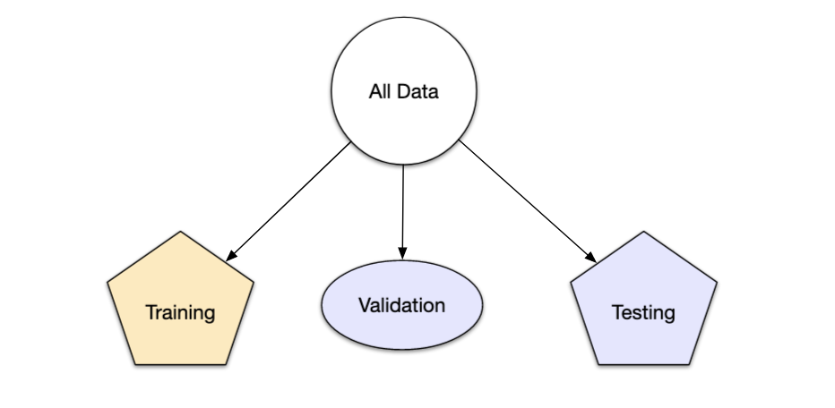

<div class="watermark"></div>

# Repaso

En los cursos anteriores, hemos hablando a cerca del proceso completo de Ciencia de Datos, para poder empezar con la segunda parte del curso de Analisis Supervisado, valele la pena hacer un breve repaso de lo que hemos estudiado hasta el momento.

## Machine Learning 

**Machine Learning** o --aprendizaje automático-- es una rama de la inteligencia artificial que permite que las máquinas aprendan de los patrones existentes en los datos. Se usan métodos computacionales para aprender de datos con el fin de producir reglas para mejorar el desempeño en alguna tarea o toma de decisión. (Está enfocado en la programación de máquinas para aprender de los patrones existentes en datos principalmente estructurados y anticiparse al futuro)

```{r echo=FALSE,fig.align='center', out.width='600pt'}
knitr::include_graphics("img/01-repaso/02_ml.png")
```

```{r echo=FALSE,fig.align='center',out.width='600pt'}
knitr::include_graphics("img/01-repaso/03_supervisado_robo.png")
```


## Tipos de aprendizaje

Platicamos en el módulo pasado que al hablar de Machine Learning, existen distintos tipos de aprendizaje, siendo los más comúnes:

* Aprendizaje supervisado 
* Aprendizaje no supervisado

Otreos ejemplos de especialidades son

* Aprendizaje profundo
* Aprendizaje por refuerzo

La diferencia entre el análisis supervisado y el no supervisado es la etiqueta, es decir, en el análisis supervisado tenemos una etiqueta "correcta" y el objetivo de los algoritmos es predecir esta etiqueta.

### Aprendizaje supervisado

-   Conocemos la respuesta correcta de antemano.

-   Esta respuesta correcta fue "etiquetada" por un humano (la mayoría de las veces, en algunas circunstancias puede ser generada por otro algoritmo).

-   Debido a que conocemos la respuesta correcta, existen muchas métricas de desempeño del modelo para verificar que nuestro algoritmo está haciendo las cosas "bien".

#### Tipos de aprendizaje supervisado (Regresión vs clasificación)

Existen dos tipos principales de aprendizaje supervisado, esto depende del tipo de la variable respuesta:

-   Los algoritmos de **clasificación** se usan cuando el resultado deseado es una etiqueta discreta, es decir, clasifican un elemento dentro de diversas clases.

-   En un problema de **regresión**, la variable target o variable a predecir es un valor numérico.

<br/>

```{r echo=FALSE,fig.align='center', out.height='450pt', out.width='700pt'}
knitr::include_graphics("img/01-repaso/13_regresion_clasificacion.png")
```

### Aprendizaje no supervisado

-   Aquí no tenemos la respuesta correcta de antemano ¿cómo podemos saber que el algoritmo está bien o mal?

-   Estadísticamente podemos verificar que el algoritmo está bien

-   Siempre tenemos que verificar con el cliente si los resultados que estamos obteniendo tienen sentido de negocio. Por ejemplo, número de grupos y características

```{r echo=FALSE,fig.align='center'}
knitr::include_graphics("img/01-repaso/14_nosupervisado_robo.png")
```

## Errores: Sesgo vs varianza


En el mundo de Machine Learning cuando desarrollamos un modelo nos esforzamos para hacer que sea lo más preciso, ajustando los parámetros, pero la realidad es que no se puede construir un modelo 100% preciso ya que nunca pueden estar libres de errores.

Comprender cómo las diferentes fuentes de error generan sesgo y varianza nos ayudará a mejorar el proceso de ajuste de datos, lo que resulta en modelos más precisos, adicionalmente también evitará el error de sobreajuste y falta de ajuste.


- **Error por sesgo:**

Es la diferencia entre la predicción esperada de nuestro modelo y los valores verdaderos. Aunque al final nuestro objetivo es siempre construir modelos que puedan predecir datos muy cercanos a los valores verdaderos, no siempre es tan fácil porque algunos algoritmos son simplemente demasiado rígidos para aprender señales complejas del conjunto de datos.


Imagina ajustar una regresión lineal a un conjunto de datos que tiene un patrón no lineal, no importa cuántas observaciones más recopiles, una regresión lineal no podrá modelar las curvas en esos datos. Esto se conoce como *underfitting*.

- **Error por varianza:**

Se refiere a la cantidad que la estimación de la función objetivo cambiará si se utiliza diferentes datos de entrenamiento. La función objetivo se estima a partir de los datos de entrenamiento mediante un algoritmo de Machine Learning, por lo que deberíamos esperar que el algoritmo tenga alguna variación. Idealmente no debería cambiar demasiado de un conjunto de datos de entrenamiento a otro.

```{r echo=FALSE,fig.align='center', out.height='350pt', out.width='650pt'}
knitr::include_graphics("img/01-repaso/3-1-3-biasvar.png")
```

Los algoritmos de Machine Learning que tienen una gran varianza están fuertemente influenciados por los detalles de los datos de entrenamiento, esto significa que los detalles de la capacitación influyen en el número y los tipos de parámetros utilizados para caracterizar la función de mapeo.


- **Error irreducible:**
El error irreducible no se puede reducir, independientemente de qué algoritmo se usa. También se le conoce como ruido y, por lo general, proviene por factores como variables desconocidas que influyen en el mapeo de las variables de entrada a la variable de salida, un conjunto de características incompleto o un problema mal enmarcado. Acá es importante comprender que no importa cuán bueno hagamos nuestro modelo, nuestros datos tendrán cierta cantidad de ruido o un error irreductible que no se puede eliminar. 

## Partición de datos

```{r, fig.align='left', out.height='150pt', out.width='150pt', echo=F, include=TRUE}
knitr::include_graphics("img/04-ml/3-5-particion-datos.jpg")
```

Cuando hay una gran cantidad de datos disponibles, una estrategia inteligente es asignar subconjuntos específicos de datos para diferentes tareas, en lugar de asignar la mayor cantidad posible solo a la estimación de los parámetros del modelo. 

Si el conjunto inicial de datos no es lo suficientemente grande, habrá cierta superposición
de cómo y cuándo se asignan nuestros datos, y es importante contar con una metodología
sólida para la partición de datos.


### Métodos comunes para particionar datos

El enfoque principal para la validación del modelo es dividir el conjunto de datos existente en dos conjuntos distintos:

* **Entrenamiento:** Este conjunto suele contener la mayoría de los datos, los cuales
sirven para la construcción de modelos donde se pueden ajustar diferentes modelos,
se investigan estrategias de ingeniería de características, etc. 

  La mayor parte del proceso de modelado se utiliza este conjunto.

* **Prueba:**  La otra parte de las observaciones se coloca en este conjunto.
Estos datos se mantienen en reserva hasta que se elijan uno o dos modelos como los de mejor rendimiento. 

  El conjunto de prueba se utiliza como árbitro final para determinar la eficiencia del modelo, 
  por lo que es fundamental mirar el conjunto de prueba una sola vez. 

Supongamos que asignamos el $80\%$ de los datos al conjunto de entrenamiento y el $20\%$ restante a las pruebas. El método más común es utilizar un muestreo aleatorio simple.
El paquete *rsample* tiene herramientas para realizar divisiones de datos como esta; 
la función `initial_split()` fue creada para este propósito.

```{r}
library(tidymodels)

tidymodels_prefer()

# Fijar un número aleatorio con para que los resultados puedan ser reproducibles 
set.seed(123)

# Partición 80/20 de los datos
ames_split <- initial_split(ames, prop = 0.80)
ames_split
```

La información impresa denota la cantidad de datos en el conjunto de entrenamiento
$(n = 2,344)$, la cantidad en el conjunto de prueba $(n = 586)$
y el tamaño del grupo original de muestras $(n = 2,930)$.

El objeto `ames_split` es un objeto *rsplit* y solo contiene la información de partición; para obtener los conjuntos de datos resultantes, aplicamos dos funciones más:

```{r}
ames_train <- training(ames_split)
ames_test  <-  testing(ames_split)

dim(ames_train)
```

El muestreo aleatorio simple es apropiado en muchos casos, pero hay excepciones. 

Cuando hay un desbalance de clases en los problemas de clasificación, el uso de una muestra aleatoria simple puede asignar al azar estas muestras poco frecuentes de manera desproporcionada al conjunto de entrenamiento o prueba. 

Para evitar esto, se puede utilizar un muestreo estratificado. La división de entrenamiento/prueba se lleva a cabo por separado dentro de cada clase y luego estas submuestras se combinan en el conjunto general de entrenamiento y prueba. 

Para los problemas de regresión, los datos de los resultados se pueden agrupar artificialmente en cuartiles y luego realizar un muestreo estratificado cuatro veces por separado. Este es un método eficaz para mantener similares las distribuciones del resultado entre el conjunto de entrenamiento y prueba.

```{r, echo=FALSE}
a <- quantile(log(ames$Sale_Price), prob = 0.25)
b <- quantile(log(ames$Sale_Price), prob = 0.5)
c <- quantile(log(ames$Sale_Price), prob = 0.75)


ggplot(ames, aes(x = log(Sale_Price)))+
  geom_density(alpha = .2)+
  geom_vline(aes(xintercept = a), linetype ="longdash", size = .5)+
  geom_vline(aes(xintercept = b), linetype ="longdash", size = .5)+
  geom_vline(aes(xintercept = c), linetype ="longdash", size = .5)+
  ylab('y')+
  theme_minimal()

```

Observamos que la distribución del precio de venta está sesgada a la derecha.
Las casas más caras no estarían bien representadas en el conjunto de entrenamiento con una simple partición; esto aumentaría el riesgo de que nuestro modelo sea ineficaz para predecir el precio de dichas propiedades. 

Las líneas verticales punteadas indican los cuatro cuartiles para estos datos.
Una muestra aleatoria estratificada llevaría a cabo la división 80/20 dentro de cada uno de estos subconjuntos de datos y luego combinaría los resultados. En *rsample*, esto se logra usando el argumento de estratos:

```{r}
set.seed(123)
ames_split <- initial_split(ames, prop = 0.80, strata = Sale_Price)
ames_train <- training(ames_split)
ames_test  <-  testing(ames_split)
```

**Hay muy pocas desventajas en el uso de muestreo estratificado.**

Un caso es cuando los datos tienen un componente de tiempo, como los datos de series de tiempo. 
Aquí, es más común utilizar los datos más recientes como conjunto de prueba.

El paquete *rsample* contiene una función llamada `initial_time_split()` 
que es muy similar a `initial_split()`. En lugar de usar un muestreo aleatorio, el argumento `prop`
denota qué proporción de la primera parte de los datos debe usarse como conjunto de entrenamiento;
la función asume que los datos se han clasificado previamente en un orden apropiado.

### ¿Qué proporción debería ser usada?

No hay un porcentaje de división óptimo para el conjunto de entrenamiento y prueba.
Muy pocos datos en el conjunto de entrenamiento obstaculizan la capacidad del modelo para encontrar estimaciones de parámetros adecuadas y muy pocos datos en el conjunto de prueba reducen la calidad de las estimaciones de rendimiento.

Se debe elegir un porcentaje que cumpla con los objetivos de nuestro proyecto con consideraciones que incluyen:

  * Costo computacional en el entrenamiento del modelo.
  * Costo computacional en la evaluación del modelo.
  * Representatividad del conjunto de formación.
  * Representatividad del conjunto de pruebas.
    

 Los porcentajes de división más comunes comunes son:

  * Entrenamiento: $80\%$, Prueba: $20\%$
  * Entrenamiento: $67\%$, Prueba: $33\%$
  * Entrenamiento: $50\%$, Prueba: $50\%$
    
### Conjunto de validación 

El conjunto de validación se definió originalmente cuando los investigadores se dieron cuenta de que medir el rendimiento del conjunto de entrenamiento conducía a resultados que eran demasiado optimistas.

Esto llevó a modelos que se sobreajustaban, lo que significa que se desempeñaron muy bien en el conjunto de entrenamiento pero mal en el conjunto de prueba.

Para combatir este problema, se retuvo un pequeño conjunto de datos de *validación* y se utilizó para medir el rendimiento del modelo mientras este está siendo entrenado. Una vez que la tasa de error del conjunto de validación comenzara a aumentar, la capacitación se detendría.

En otras palabras, el conjunto de validación es un medio para tener una idea aproximada de qué tan bien se desempeñó el modelo antes del conjunto de prueba.

```{r, fig.align='center', out.height='250pt', out.width='500pt', echo=F, include=TRUE}

```


## Ingeniería de características (Feature Engineering)

La ingenería de datos y procesamiento de datos es parte vital del desarrollo de un buen modelo. 

En este curso analizaremos distintos métodos de machine learning que permitirán predecir una respuesta numérica o categórica. Usaremos el lenguaje de programación *R* para dicho procesamiento. 

-------------------------------------------------------------------------------------

```{r, include=FALSE}
library(tidyverse)
library(tidymodels) 
library(recipes)
library(ggplot2)
library(kableExtra)
```

Hay varios pasos que se deben de seguir para crear un modelo útil:

* Recopilación de datos.
* Limpieza de datos.
* Creación de nuevas variables.
* Estimación de parámetros.
* Selección y ajuste del modelo.
* Evaluación del rendimiento.

Al comienzo de un proyecto, generalmente hay un conjunto finito de datos disponibles para todas estas tareas.

**OJO:** A medida que los datos se reutilizan para múltiples tareas, aumentan los riesgos de agregar sesgos o grandes efectos de errores metodológicos.

### Pre-procesamiento de datos

```{r, fig.align='center', out.height='200pt', out.width='800pt', echo=F, include=TRUE}

# Ponerla al principio de pre-procesamiento 

knitr::include_graphics("img/04-ml/3-2-1-preprocesamiento.png")
```

Como punto de partida para nuestro flujo de trabajo de aprendizaje automático, necesitaremos datos de entrada.
En la mayoría de los casos, estos datos se cargarán y almacenarán en forma de *data frames* o *tibbles* en R. 
Incluirán una o varias variables predictoras y, en caso de aprendizaje supervisado, también incluirán un resultado conocido.

Sin embargo, no todos los modelos pueden lidiar con diferentes problemas de datos y, a menudo,
necesitamos transformar los datos para obtener el mejor rendimiento posible del modelo.
Este proceso se denomina pre-procesamiento y puede incluir una amplia gama de pasos, como:

  * **Dicotomización de variables:** Variables cualitativas que solo pueden tomar 
el valor $0$ o $1$ para indicar la ausencia o presencia de una condición específica.
Estas variables se utilizan para clasificar los datos en categorías mutuamente excluyentes o para activar comandos de encendido / apagado


```{r, fig.align='center', out.height='200pt', out.width='600pt', echo=F, include=TRUE}

knitr::include_graphics("img/04-ml/hombre-mujer.jpg")

knitr::include_graphics("img/04-ml/sino.jpg")
```


  * **Near Zero Value (nzv) o Varianza Cero:** En algunas situaciones, el mecanismo de generación de datos puede crear predictores que solo tienen un valor único (es decir, un "predictor de varianza cercando a cero"). Para muchos modelos (excluidos los modelos basados en árboles), esto puede hacer que el modelo se bloquee o que el ajuste sea inestable.

De manera similar, los predictores pueden tener solo una pequeña cantidad de valores únicos que ocurren con frecuencias muy bajas.
    
    
   
```{r, fig.align='center', out.width='500pt', echo=F, include=TRUE}

knitr::include_graphics("img/04-ml/hombres.jpg")

``` 

* **Imputaciones:** Si faltan algunos predictores, ¿deberían estimarse mediante imputación?

```{r, fig.align='center', out.width='400pt', echo=F, include=TRUE}

knitr::include_graphics("img/04-ml/imputar.jpg")

``` 
  * **Des-correlacionar:**  Si hay predictores correlacionados, ¿debería mitigarse esta correlación? Esto podría significar filtrar predictores, usar análisis de componentes principales o una técnica basada en modelos (por ejemplo, regularización). 
  
```{r, fig.align='center', out.width='400pt', echo=F, include=TRUE}

knitr::include_graphics("img/04-ml/descorrelaciones.jpg")

``` 
   * **Normalizar:** ¿Deben centrarse y escalar los predictores?
   
   
```{r, fig.align='center', out.width='800pt', echo=F, include=TRUE}

knitr::include_graphics("img/04-ml/estandarizar-reescalar.jpg")

``` 
   
   
   * **Transformar:** ¿Es útil transformar los predictores para que sean más simétricos? (por ejemplo, escala logarítmica).

   
Dependiendo del caso de uso, algunos pasos de pre-procesamiento pueden ser indispensables para pasos posteriores, mientras que otros solo son opcionales. Sin embargo, dependiendo de los pasos de pre-procesamiento elegidos, el rendimiento del modelo puede cambiar significativamente en pasos posteriores. Por lo tanto, es muy común probar varias configuraciones.

En la tabla, $\checkmark$ indica que el método es obligatorio para el modelo y $\times$ indica que no lo es. El símbolo $\circ$ significa que la técnica puede ayudar al modelo, pero no es obligatorio. 

```{r, fig.align='center', out.height='650pt', out.width='600pt', echo=F}
knitr::include_graphics("img/04-ml/3-2-1-preprocesamiento-modelos.png")
```
Notación: 

  1. Es posible que la des-correlación de predictores no ayude a mejorar el rendimiento. Sin embargo, menos predictores correlacionados pueden mejorar la estimación de las puntuaciones de importancia de la varianza.
  Esencialmente, la selección de predictores altamente correlacionados es casi aleatoria.
  
  La notación $+$ significa que la respuesta depende de la implementación:

  * Teoricamente, cualquier modelo basado en árboles no requiere imputación de datos, 
    sin embargo, muchas implementaciones de conjuntos de árboles requieren imputación. 

  * Si bien los métodos de refuerzo basados en árboles generalmente no requieren la creación de variables ficticias, los modelos que usan `xgboost` sí lo hacen.

### Ingeniería de datos

La ingeniería de datos abarca actividades que reformatean los valores de los predictores 
para que se puedan utilizar de manera eficaz para nuestro modelo.
Esto incluye transformaciones y codificaciones de los datos para representar mejor sus características importantes.

Por ejemplo: 

>  **1.-** Supongamos que un conjunto de datos tiene dos predictores que se pueden representar de manera más eficaz en nuestro modelo como una proporción, así, tendríamos un nuevo predictor a partir de la proporción de los dos predictores originales.

```{r, echo=F}

prop <-  c(691, 639, 969, 955, 508)

total <- sum(prop)
  
props <- data.frame(x = prop, x_prop = prop/total) 

props %>%
  kbl() %>%
  kable_classic_2(full_width = F)
  #kable_minimal(full_width = F, html_font = "Cambria")
```

> **2.-** Al elegir cómo codificar nuestros datos en el modelado, podríamos elegir una opción que creemos que está más asociada con el resultado. El formato original de los datos, por ejemplo numérico (edad) versus categórico (grupo).

```{r, echo=F}

edades <- data.frame('Edad' = c(7, 78, 17, 25, 90), 'Grupo' = c('Niños', 
                                                                'Adultos mayores',
                                                                'Adolescentes',
                                                                'Adultos',
                                                                'Adultos mayores'))
edades %>% 
 kbl() %>%
  kable_classic_2(full_width = F)
  #kable_minimal(full_width = F, html_font = "Cambria")
```

La ingeniería y el pre-procesamiento de datos también pueden implicar el reformateo requerido por el modelo. Algunos modelos utilizan métricas de distancia geométrica y, en consecuencia, los predictores numéricos deben centrarse y escalar para que estén todos en las mismas unidades. De lo contrario, los valores de distancia estarían sesgados por la escala de cada columna.


## Partición de datos

```{r, fig.align='left', out.height='150pt', out.width='150pt', echo=F, include=TRUE}
knitr::include_graphics("img/04-ml/3-5-particion-datos.jpg")
```

Cuando hay una gran cantidad de datos disponibles, una estrategia inteligente es asignar subconjuntos específicos de datos para diferentes tareas, en lugar de asignar la mayor cantidad posible solo a la estimación de los parámetros del modelo. 

Si el conjunto inicial de datos no es lo suficientemente grande, habrá cierta superposición
de cómo y cuándo se asignan nuestros datos, y es importante contar con una metodología
sólida para la partición de datos.


### Métodos comunes para particionar datos

El enfoque principal para la validación del modelo es dividir el conjunto de datos existente en dos conjuntos distintos:

* **Entrenamiento:** Este conjunto suele contener la mayoría de los datos, los cuales
sirven para la construcción de modelos donde se pueden ajustar diferentes modelos,
se investigan estrategias de ingeniería de características, etc. 

  La mayor parte del proceso de modelado se utiliza este conjunto.

* **Prueba:**  La otra parte de las observaciones se coloca en este conjunto.
Estos datos se mantienen en reserva hasta que se elijan uno o dos modelos como los de mejor rendimiento. 

  El conjunto de prueba se utiliza como árbitro final para determinar la eficiencia del modelo, 
  por lo que es fundamental mirar el conjunto de prueba una sola vez. 

Supongamos que asignamos el $80\%$ de los datos al conjunto de entrenamiento y el $20\%$ restante a las pruebas. El método más común es utilizar un muestreo aleatorio simple.
El paquete *rsample* tiene herramientas para realizar divisiones de datos como esta; 
la función `initial_split()` fue creada para este propósito.

```{r}
library(tidymodels)

tidymodels_prefer()

# Fijar un número aleatorio con para que los resultados puedan ser reproducibles 
set.seed(123)

# Partición 80/20 de los datos
ames_split <- initial_split(ames, prop = 0.80)
ames_split
```

La información impresa denota la cantidad de datos en el conjunto de entrenamiento
$(n = 2,344)$, la cantidad en el conjunto de prueba $(n = 586)$
y el tamaño del grupo original de muestras $(n = 2,930)$.

El objeto `ames_split` es un objeto *rsplit* y solo contiene la información de partición; para obtener los conjuntos de datos resultantes, aplicamos dos funciones más:

```{r}
ames_train <- training(ames_split)
ames_test  <-  testing(ames_split)

dim(ames_train)
```

El muestreo aleatorio simple es apropiado en muchos casos, pero hay excepciones. 

Cuando hay un desbalance de clases en los problemas de clasificación, el uso de una muestra aleatoria simple puede asignar al azar estas muestras poco frecuentes de manera desproporcionada al conjunto de entrenamiento o prueba. 

Para evitar esto, se puede utilizar un muestreo estratificado. La división de entrenamiento/prueba se lleva a cabo por separado dentro de cada clase y luego estas submuestras se combinan en el conjunto general de entrenamiento y prueba. 

Para los problemas de regresión, los datos de los resultados se pueden agrupar artificialmente en cuartiles y luego realizar un muestreo estratificado cuatro veces por separado. Este es un método eficaz para mantener similares las distribuciones del resultado entre el conjunto de entrenamiento y prueba.

```{r, echo=FALSE}
a <- quantile(log(ames$Sale_Price), prob = 0.25)
b <- quantile(log(ames$Sale_Price), prob = 0.5)
c <- quantile(log(ames$Sale_Price), prob = 0.75)


ggplot(ames, aes(x = log(Sale_Price)))+
  geom_density(alpha = .2)+
  geom_vline(aes(xintercept = a), linetype ="longdash", size = .5)+
  geom_vline(aes(xintercept = b), linetype ="longdash", size = .5)+
  geom_vline(aes(xintercept = c), linetype ="longdash", size = .5)+
  ylab('y')+
  theme_minimal()

```

Observamos que la distribución del precio de venta está sesgada a la derecha.
Las casas más caras no estarían bien representadas en el conjunto de entrenamiento con una simple partición; esto aumentaría el riesgo de que nuestro modelo sea ineficaz para predecir el precio de dichas propiedades. 

Las líneas verticales punteadas indican los cuatro cuartiles para estos datos.
Una muestra aleatoria estratificada llevaría a cabo la división 80/20 dentro de cada uno de estos subconjuntos de datos y luego combinaría los resultados. En *rsample*, esto se logra usando el argumento de estratos:

```{r}
set.seed(123)
ames_split <- initial_split(ames, prop = 0.80, strata = Sale_Price)
ames_train <- training(ames_split)
ames_test  <-  testing(ames_split)
```

**Hay muy pocas desventajas en el uso de muestreo estratificado.**

Un caso es cuando los datos tienen un componente de tiempo, como los datos de series de tiempo. 
Aquí, es más común utilizar los datos más recientes como conjunto de prueba.

El paquete *rsample* contiene una función llamada `initial_time_split()` 
que es muy similar a `initial_split()`. En lugar de usar un muestreo aleatorio, el argumento `prop`
denota qué proporción de la primera parte de los datos debe usarse como conjunto de entrenamiento;
la función asume que los datos se han clasificado previamente en un orden apropiado.

### ¿Qué proporción debería ser usada?

No hay un porcentaje de división óptimo para el conjunto de entrenamiento y prueba.
Muy pocos datos en el conjunto de entrenamiento obstaculizan la capacidad del modelo para encontrar estimaciones de parámetros adecuadas y muy pocos datos en el conjunto de prueba reducen la calidad de las estimaciones de rendimiento.

Se debe elegir un porcentaje que cumpla con los objetivos de nuestro proyecto con consideraciones que incluyen:

  * Costo computacional en el entrenamiento del modelo.
  * Costo computacional en la evaluación del modelo.
  * Representatividad del conjunto de formación.
  * Representatividad del conjunto de pruebas.
    

 Los porcentajes de división más comunes comunes son:

  * Entrenamiento: $80\%$, Prueba: $20\%$
  * Entrenamiento: $67\%$, Prueba: $33\%$
  * Entrenamiento: $50\%$, Prueba: $50\%$
    
### Conjunto de validación 

El conjunto de validación se definió originalmente cuando los investigadores se dieron cuenta de que medir el rendimiento del conjunto de entrenamiento conducía a resultados que eran demasiado optimistas.

Esto llevó a modelos que se sobreajustaban, lo que significa que se desempeñaron muy bien en el conjunto de entrenamiento pero mal en el conjunto de prueba.

Para combatir este problema, se retuvo un pequeño conjunto de datos de *validación* y se utilizó para medir el rendimiento del modelo mientras este está siendo entrenado. Una vez que la tasa de error del conjunto de validación comenzara a aumentar, la capacitación se detendría.

En otras palabras, el conjunto de validación es un medio para tener una idea aproximada de qué tan bien se desempeñó el modelo antes del conjunto de prueba.

```{r, fig.align='center', out.height='250pt', out.width='500pt', echo=F, include=TRUE}

```

## Recetas

```{r, fig.align='left', out.height='150pt', out.width='150pt', echo=F, include=TRUE}
knitr::include_graphics("img/04-ml/3-2-3-recetas.png")
```


Una receta es una **serie de pasos o instrucciones para el procesamiento de datos.**
A diferencia del método de fórmula dentro de una función de modelado, **la receta define los pasos sin ejecutarlos** inmediatamente; es sólo una especificación de lo que se debe hacer. La estructura de una receta sigue los siguientes pasos:

1. Inicialización

2. Transformación

3. Preparación

4. Aplicación

La siguiente sección explica la estructura y flujo de transformaciones:

```{r, eval=FALSE}
receta <- recipe(response ~ X1 + X2 + X3 + ... + Xn, data = dataset ) %>% 
  transformation_1(...) %>% 
  transformation_2(...) %>% 
  transformation_3(...) %>% 
  ...
  final_transformation(...) %>% 
  prep()

bake(receta, new_data = new_dataset)
```

A continuación se muestran distintos ejemplos de transformaciones realizadas comunmente en el pre-procesamiento de modelos predictivos. Como ejemplo, utilizaremos el subconjunto de predictores disponibles en los datos de vivienda: `Ames`

* Vecindario (29 vecindarios)

* Superficie habitable bruta sobre el nivel del suelo

* Año de constricción

* Tipo de edificio

**ANTERIORMENTE...** Un modelo de regresión lineal ordinario se ajustaba a los datos con la función estándar `lm()` de la siguiente manera:

```{r, echo=FALSE}
data("ames")
```

```{r, echo=TRUE, eval=FALSE}
lm(Sale_Price ~ Neighborhood + log10(Gr_Liv_Area) + Year_Built + Bldg_Type, data = ames)
```

Cuando se ejecuta esta función, los datos se convierten en a una matriz de diseño numérico (también llamada matriz de modelo) y luego se utiliza el método de mínimos cuadrados para estimar los parámetros.
Lo que hace **la fórmula anterior se puede descomponer en una serie de pasos:**

> **1.-** El precio de venta se define como el resultado, mientras que las variables de vecindario, superficie habitable bruta, año de construcción y tipo de edificio se definen como predictores.

> **2.-** Se aplica una transformación logarítmica al predictor de superficie habitable bruta.

> **3.-** Las columnas de vecindad y tipo de edificio se convierten de un formato no numérico a un formato numérico (dado que los mínimos cuadrados requieren predictores numéricos). 

La siguiente receta es equivalente a la fórmula anterior:

```{r}
simple_ames <- recipe(
  Sale_Price ~ Neighborhood + Gr_Liv_Area + Year_Built + Bldg_Type,
  data = ames) %>%
  step_log(Gr_Liv_Area, base = 10) %>% 
  step_dummy(all_nominal_predictors())

simple_ames

```

**Ventajas de usar una receta:**

* **Los cálculos se pueden reciclar entre modelos** ya que no están estrechamente acoplados a la función de modelado.

* Una receta permite un **conjunto más amplio de opciones de procesamiento** de datos que las que pueden ofrecer las fórmulas.

* La **sintaxis puede ser muy compacta**. Por ejemplo, `all_nominal_predictors()` se puede usar para capturar muchas variables para tipos específicos de procesamiento, mientras que una fórmula requeriría que cada una se enumere explícitamente.

* Todo el procesamiento de datos se puede capturar en un solo objeto en lugar de tener scripts que se repiten o incluso se distribuyen en diferentes archivos. 

### Pasos y estructura de recetas 

Como se mostró anteriormente, existen 4 pasos fundamentales para el procesamiento y transformación de conjuntos de datos. Estos pasos se describen de la siguiente manera:

* **Receta:** Inicializa una receta y define los roles de las variables

* **Transformaciones:** Mutaciones a los renglones y columnas hasta desear el resultado

* **Preparación:** Se realizan las estimaciones estadísticas con los datos

La función **`prep()`** estima las cantidades requeridas y las estadísticas necesarias para cualquier paso declarado en la receta. 

```{r}
prep <- prep(simple_ames) 

prep
```

* **Aplicación** Se llevan a cabo las transformaciones especificadas en la receta preparada a un conjunto de datos.

Finalmente, la función **`bake()`** lleva a cabo la transformación de un conjunto de datos a través de las estimaciones indicadas en una receta y **aplica las operaciones a un conjunto de datos para crear una matriz de diseño**. La función `bake(object, new_data = NULL)` devolverá los datos con los que se entrenó la receta.

**Nota: ** La función **`juice()`** devolverá los resultados de una receta en la que se hayan aplicado todos los pasos a los datos. Similar a la función `bake()` con el comando `new_data = NULL`.

```{r}
simple_ames %>% 
  prep() %>% 
  bake(new_data = NULL) %>% 
  glimpse()
```

En cuanto a las transformaciones posibles, existe una gran cantidad de funciones que soportan este proceso. En esta sección se muestran algunas de las transformación más comunes, entre ellas:

* Normalización
* Dicotomización
* Creación de nuevas columnas
* Datos faltantes
* Imputaciones
* Interacciones
* Etc.

#### Normalizar columnas numéricas

Quizá la transformación numérica más usada en todos los modelos es la estandarización o normalización de variables numéricas. **Este proceso se realiza para homologar la escala de las variables numéricas**, de modo que no predomine una sobre otra debido a la diferencia de magnitudes o escalas. Este proceso se tiene de fondo el siguiente proceso estadístico:

$$Z=\frac{X-\hat{\mu}_x}{\hat{\sigma}_x}$$

**Donde:**

* X = Es una variable o columna numérica

* $\hat{\mu}_x$ = Es la estimación de la media de la variable *X*

* $\hat{\sigma}_x$ = Es la estimación de la desviación estándar de la variable *X*

La librería recipes nos permite realizar este proceso ágilmente mediante la función: `step_normalize()`.

```{r}
ames %>% select(Sale_Price, Neighborhood, Gr_Liv_Area, Year_Built, Bldg_Type) %>% 
  head(5)

simple_ames <- recipe(Sale_Price ~ ., data = ames) %>%
  step_normalize(all_numeric_predictors())

simple_ames

simple_ames %>% 
  prep() %>% 
  bake(new_data = NULL) %>% 
  select(Sale_Price, Neighborhood, Gr_Liv_Area, Year_Built, Bldg_Type) %>% 
  head(5)

```

#### Dicotomización de categorías

Otra transformación necesaria en la mayoría de los modelos predictivos en la creación de las variables dummy. Se mencionó anteriormente que los modelos requieren de una matriz numérica de características explicativas que permita calcular patrones estadísticos para predecir la variable de respuesta. El proceso de dicotomización consiste en **crear una variable dicotómica por cada categoría de una columna con valores nominales**.

```{r}
ames %>% select(Sale_Price, Bldg_Type) %>% head(5)

ames %>% select(Bldg_Type) %>% distinct() %>% pull()

simple_ames <- recipe(Sale_Price ~ Bldg_Type, data = ames) %>%
  step_dummy(all_nominal_predictors()) %>% 
  prep()

simple_ames

simple_ames %>% bake(new_data = NULL) %>% head(5)
```
El proceso de dicotomización demanda que únicamente `(n-1)` categorías sean expresadas, mientras que la restante será considerada la **categoría default o basal**. Esta última categoría es la usada en el modelo cuando todas las demás se encuentran ausentes. 

#### Codificación de datos cualitativos nuevos o faltantes

Una de las tareas de ingeniería de datos más comunes es el tratamiento de datos faltantes, datos no antes vistos y datos con poca frecuencia. **El problema principal con estos casos es que los modelos no saben cómo relacionar estos eventos con futuras predicciones**. Es conveniente realizar las transformaciones necesarias de tratamiento de estos datos antes de pasar a la etapa de modelado.

Por ejemplo: 

* `step_unknown()` cambia los valores perdidos en un nivel de factor "desconocido". 

* `step_other()` analiza las frecuencias de los niveles de los factores en el conjunto de datos y convierte los valores que ocurren con poca frecuencia a un nivel general de "otro", con un umbral que se puede especificar.

* `step_novel()` puede asignar un nuevo nivel si anticipamos que se puede encontrar un nuevo factor en datos futuros.

Un buen ejemplo es el predictor de **vecindad** en nuestros datos. Aquí hay dos vecindarios que tienen menos de cinco propiedades.

```{r}
ggplot(data = ames, aes(y = Neighborhood)) + 
  geom_bar() + 
  labs(y = NULL)
```

Para algunos modelos, puede resultar problemático tener variables dummy con una sola entrada distinta de cero en la columna. Como mínimo, es muy improbable que estas características sean importantes para un modelo. 

Si agregamos `step_other (Neighborhood, threshold = 0.01)` a nuestra receta, el último $1\%$ de los vecindarios se agrupará en un nuevo nivel llamado "otro", esto atrapará a 8 vecindarios. 

```{r}
simple_ames <- recipe(
  Sale_Price ~ Neighborhood + Gr_Liv_Area + Year_Built + Bldg_Type,
  data = ames) %>%
  step_other(Neighborhood, threshold = 0.01) %>% 
  prep()

ejemplo <- juice(simple_ames)

ggplot(ejemplo, aes(y = Neighborhood)) + 
  geom_bar() + 
  labs(y = NULL)
```

### Imputaciones

La función `step_unknown` crea una categoría nombrada `unknown`, la cual sirve como reemplazo de datos categóricos faltantes, sin embargo, para imputar datos numéricos se requiere de otra estrategia. Las imputaciones o sustituciones más comunes son realizadas a través de medidas de tendencia central tales como la media y mediana. A continuación se muestra un ejemplo:

```{r}
ames_na <- ames
ames_na[sample(nrow(ames), 5), c("Gr_Liv_Area", "Lot_Area")] <- NA

ames_na %>% filter(is.na(Gr_Liv_Area) | is.na(Lot_Area)) %>% 
  select(Sale_Price, Gr_Liv_Area, Lot_Area)

simple_ames <- recipe(Sale_Price ~ Gr_Liv_Area + Lot_Area, data = ames_na) %>%
  step_impute_mean(Gr_Liv_Area) %>% 
  step_impute_median(Lot_Area) %>% 
  prep()

bake(simple_ames, new_data = ames_na) %>% 
  filter(is.na(Gr_Liv_Area) | is.na(Lot_Area))
```

Forzamos algunos renglones a que sean omitidos aleatoriamente. Posteriormente, estos valores son imputados mediante su media y mediana.

### Agregar o modificar columnas

Quizá la transformación más usada sea la agregación o mutación de columnas existentes. Similar a la función `mutate()` de *dplyr*, la función `step_mutate()` se encarga de realizar esta tarea dentro de un pipeline o receta.

```{r}
ejemplo <- recipe(
  Sale_Price ~ Neighborhood + Gr_Liv_Area + Year_Built + Bldg_Type + Year_Remod_Add,
  data = ames) %>%
  step_mutate(
    Sale_Price_Peso = Sale_Price * 19.87,
    Last_Inversion = Year_Remod_Add - Year_Built
    ) %>% 
  step_arrange(desc(Last_Inversion)) %>% 
  prep()

ejemplo

ejemplo %>% bake(new_data = NULL) %>% 
  select(Sale_Price, Sale_Price_Peso, Year_Remod_Add, Year_Built, Last_Inversion)
```

En este ejemplo se realiza la creación de una nueva variable y la modificación de una ya existente.


### Interacciones

Los efectos de interacción involucran dos o más predictores. Tal efecto **ocurre cuando un predictor tiene un efecto sobre el resultado que depende de uno o más predictores.**

Numéricamente, un término de interacción entre predictores se codifica como su producto. Las interacciones solo se definen en términos de su efecto sobre el resultado y pueden ser combinaciones de diferentes tipos de datos (por ejemplo, numéricos, categóricos, etc.).

Después de explorar el conjunto de datos de Ames, podríamos encontrar que las pendientes
de regresión para el área habitable bruta difieren para los diferentes tipos de edificios: 
  
```{r}
ggplot(ames, aes(x = Gr_Liv_Area, y = Sale_Price)) + 
  geom_point(alpha = .2) +
  facet_wrap(~ Bldg_Type) + 
  geom_smooth(method = lm, formula = y ~ x, se = FALSE, col = "red") + 
  scale_x_log10() + 
  scale_y_log10() + 
  labs(x = "Gross Living Area", y = "Sale Price (USD)")
```

Con la receta actual, `step_dummy()` ya ha creado variables ficticias.
¿Cómo combinaríamos estos para una interacción? El paso adicional se vería como 
`step_interact(~ términos de interacción)` donde los términos en el lado derecho de la tilde son las interacciones. Estos pueden incluir selectores, por lo que sería apropiado usar: 

```{r}
simple_ames <- recipe(Sale_Price ~ Neighborhood + Gr_Liv_Area + Year_Built + Bldg_Type,
         data = ames) %>%
  step_other(Neighborhood, threshold = 0.05) %>% 
  step_dummy(all_nominal_predictors()) %>% 
  step_interact( ~ Gr_Liv_Area:starts_with("Bldg_Type_") ) %>% 
  prep()

simple_ames %>% bake(new_data = NULL) %>% glimpse()
```

Se pueden especificar interacciones adicionales en esta fórmula separándolas con el signo $*$.

### Transformaciones generales

Reflejando las operaciones originales de dplyr, los siguientes pasos se pueden usar para realizar una variedad de operaciones básicas a los datos.

* `step_select()`: Selecciona un subconjunto de variables específicas en el conjunto de datos.

* `step_mutate()`: Crea una nueva variable o modifica una existente usando `dplyr::mutate()`.

*  `step_mutate_at()`: Lee una especificación de un paso de receta que modificará las variables seleccionadas usando una función común a través de `dplyr::mutate_at()`.

* `step_filter()`: Crea una especificación de un paso de receta que eliminará
filas usando `dplyr::filter()`.

* `step_arrange()`: Ordena el conjunto de datos de acuerdo con una o más variables.

* `step_rm()`: Crea una especificación de un paso de receta que eliminará las 
variables según su nombre, tipo o función.

* `step_nzv()`: Realiza una selección de variables eliminando todas aquellas cuya varianza se encuentre cercana a cero.

* `step_naomit()`: Elimina todos los renglones que tengan alguna variable con valores perdidos.

* `step_normalize()`: Centra y escala las variables numéricas especificadas, generando una transformación a una distribución normal estándar.

* `step_range()`: Transforma el rango de un conjunto de variables numéricas al especificado.

* `step_interact()`: Crea un nuevo conjunto de variables basadas en la interacción entre dos variables.

* `step_ratio()`: Crea una nueva variable a partir del cociente entre dos variables.

* `all_predictors()`: Selecciona a todos los predictores del conjunto de entrenamineto para aplicarles alguna de las funciones mencionadas.

* `all_numeric_predictors()`: Selecciona a todos los predictores numéricos del conjunto de entrenamineto para aplicarles alguna de las funciones mencionadas.

* `all_nominal_predictors()`: Selecciona a todos los predictores nominales del conjunto de entrenamineto para aplicarles alguna de las funciones mencionadas.


La guía completa de las familia de funciones *step* puede consultarse en la [documentación oficial](https://recipes.tidymodels.org/reference/index.html)


Los conjuntos de validación se utilizan a menudo cuando el conjunto de datos original es muy grande. En este caso, una sola partición grande puede ser adecuada para caracterizar el rendimiento del modelo sin tener que realizar múltiples iteraciones de remuestreo.

Con *rsample*, un conjunto de validación es como cualquier otro objeto de remuestreo; este tipo es diferente solo en que tiene una sola iteración

```{r, fig.align='center', out.height='350pt', out.width='500pt', echo=F, include=TRUE}
knitr::include_graphics("img/04-ml/3-5-3-conjunto-validacion-2.png")
```

```{r}
set.seed(12)
val_set <- validation_split(ames_train, prop = 3/4, strata = NULL)
val_set #val_set contiene el conjunto de entrenamiento y validación.
```

Esta función regresa una columna para los objetos de división de datos y una columna llamada id que tiene una cadena de caracteres con el identificador de remuestreo.

El argumento de estratos hace que el muestreo aleatorio se lleve a cabo dentro de la variable de estratificación. Esto puede ayudar a garantizar que el número de datos en los datos del análisis sea equivalente a las proporciones del conjunto de datos original. (Los estratos inferiores al 10% del total se agrupan).

Otra opción de muestreo bastante común es la realizada mediante múltiples submuestras de los datos originales. 

```{r, fig.align='center', out.height='350pt', out.width='500pt', echo=F, include=TRUE}
knitr::include_graphics("img/04-ml/18_1_cross_validation.png")
```

Diversos métodos se revisarán a lo largo del curso.


### Leave-one-out cross-validation

La validación cruzada es una manera de predecir el ajuste de un modelo a un hipotético conjunto de datos de prueba cuando no disponemos del conjunto explícito de datos de prueba.

El método *LOOCV* en un método iterativo que se inicia empleando como conjunto 
de entrenamiento todas las observaciones disponibles excepto una, que se excluye
para emplearla como validación. 

Si se emplea una única observación para calcular el error, este varía mucho 
dependiendo de qué observación se haya seleccionado. Para evitarlo, el proceso
se repite tantas veces como observaciones disponibles se tengan, excluyendo en
cada iteración una observación distinta, ajustando el modelo con el resto y 
calculando el error con dicha observación. 

Finalmente, el error estimado por el es el promedio de todos lo $i$ errores calculados.

La principal desventaja de este método es su costo computacional.
El proceso requiere que el modelo sea reajustado y validado tantas veces como observaciones disponibles
se tengan lo que en algunos casos puede ser muy complicado. 

*rsample* contiene la función `loo_cv()`.

```{r}
set.seed(55)
ames_loo <- loo_cv(ames_train)
ames_loo
```
