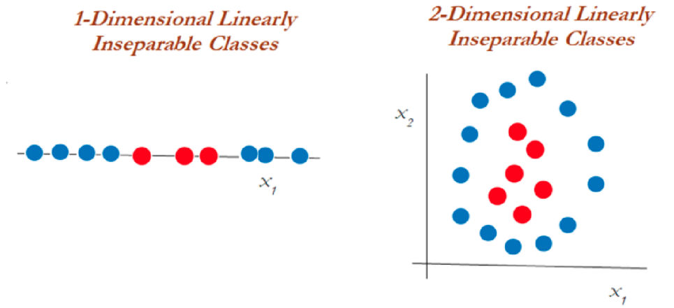
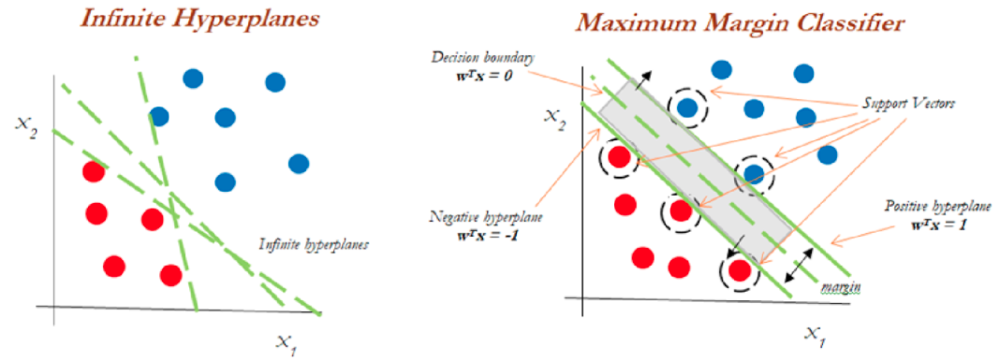
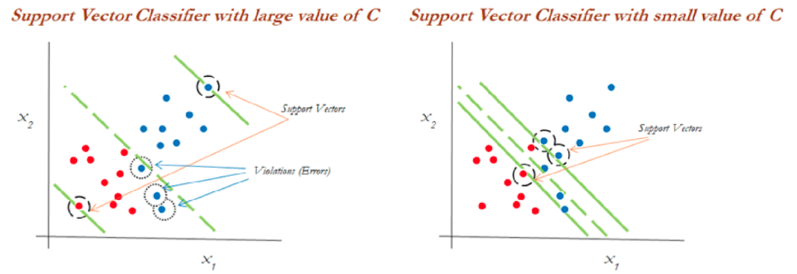
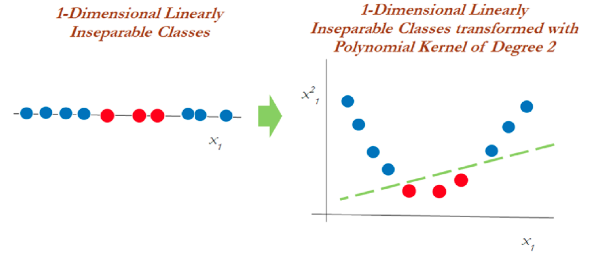
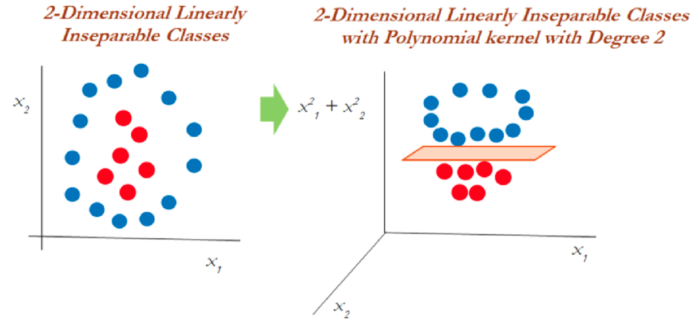
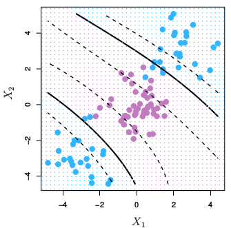
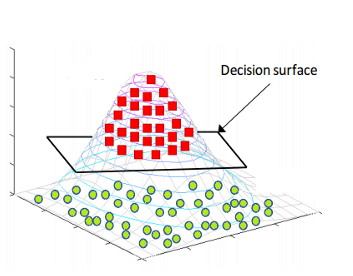

<div class="watermark"></div>

# Feature Engineering

## Transformación polinomial 

Es común encontrar en la literatura este tema como regresión polinomial, sin embargo, debido a que el alcance de esta transformación va a más allá de la regresión, preferimos manejar este tema como parte de la ingeniería de variables y no como un modelo per se.

El objetivo de la transformación polinomial dentro de la ingeniería de variables es crear nuevas variables que puedan explicar la relación entre variable de respuesta y variable explicativa a través de un polinomia de grado *k*.

En el siguiente gráfico se representa mediante una línea roja a la regresión lineal y mediante una curva azul al polinomia que relaciona a las variables independiente y dependiente.

```{r, warning=FALSE, message=FALSE, echo=FALSE}
library(ggplot2)
library(dplyr)
library(patchwork)

n = 100

x2 <- tibble(x = seq(0, 10, lengt=n)) %>% 
  mutate(y = x^2 + rnorm(n, mean = 0, sd = 5)) %>% 
  ggplot(aes(x = x, y = y)) +
  geom_point() +
  geom_smooth() +
  geom_smooth(method = "lm", col = "red") +
  ggtitle("Regresión polinomial Vs Regresión lineal") +
  xlab("Variable dependiente") +
  ylab("Variable de Respuesta")

x3 <- tibble(x = seq(-10, 10, lengt=n)) %>% 
  mutate(y = x^3 + rnorm(n, mean = 0, sd = 100)) %>% 
  ggplot(aes(x = x, y = y)) +
  geom_point() +
  geom_smooth() +
  geom_smooth(method = "lm", col = "red") +
  ggtitle("Regresión polinomial Vs Regresión lineal") +
  xlab("Variable dependiente") +
  ylab("Variable de Respuesta")

x2 / x3

```

Es evidente que existe un mejor ajuste cuando se considera un polinomio de grado *k* en vez de la componente lineal. Este método ofrece mayor flexibilidad para el ajuste de un modelo. Será importante **mediar posteriormente entre el sesgo y la varianza** de forma que podamos tener un mejor ajuste sin caer en el sobreajuste. La fórmula que expresa la relación entre variable de respuesta y explicativas es ahora:

$$Y_i \sim X_1 + X_1^2$$

Es importante mencionar que cuando se ajusta un modelo polinomial de segundo orden, se deben mantener ambas variables en el model (la original y la cuadrática). Cuando se tenga un modelo polinomial de grado *k*, se deberán conservar los *k* elementos que componen el polinomio:

$$Y\sim X_1+X_1^2 + ... + X_1^k$$

Estas transformaciones son posibles realizarlas a múltiples variables que conforman el conjunto de datos que sirve de insumo para el modelo. A través de los pasos secuenciales en las recetas podemos integrar esta tarea a través de la función `step_poly( )`. Veamos un ejemplo:


## Análisis de Componentes Principales

El análisis PCA (por sus siglas en inglés) es una **técnica de reducción de dimensión** útil tanto para el proceso de análisis exploratorio, el inferencial y el predictivos. Es una técnica ampliamente usada en muchos estudios, pues permite sintetizar la información relevante y desechar aquello que no aporta tanto a un estudio.Es particularmente útil en el caso de conjuntos de datos "amplios" en donde las **variables están correlacionadas entre sí**, donde se tienen muchas variables para cada observación. 

En los conjuntos de datos donde hay muchas variables presentes, no es fácil trazar los datos en su formato original, lo que dificulta tener una idea de las tendencias presentes en ellos. PCA permite ver la "forma" general de los datos, identificando qué observaciones son similares entre sí y cuáles son muy diferentes. Esto puede permitirnos identificar grupos de muestras que son similares y determinar qué variables hacen que un grupo sea diferente de otro.

La idea detrás de esta técnica es la siguiente:

* Se desean crear nuevas variables llamadas **Componentes Principales**, las cuales son creadas como combinación lineal (transformación lineal) de las variables originales, por lo que cada una de las variables nuevas contiene parcialmente información de todas las variables originales.

$$Z_1 = a_{11}X_1 +a_{12}X_2 + ... + a_{1p}X_p$$
$$Z_2 = a_{21}X_1 +a_{22}X_2 + ... + a_{2p}X_p$$
$$...$$
$$Z_p = a_{p1}X_1 +a_{p2}X_2 + ... + a_{pp}X_p$$

* Se desea que la primer componente principal capture la mayor varianza posible de todo el conjunto de datos.

$$\forall i \in 2,...,p \quad Var(Z_1)>Var(Z_i)$$

* La segunda componente principal deberá **SER INDEPENDIENTE** de la primera y deberá abarcar la mayor varianza posible del restante. Esta condición se debe cumplir para toda componente *i*, de tal forma que las nuevas componentes creadas son independientes entre sí y acumulan la mayor proporción de varianza en las primeras de ellas, dejando la mínima proporción de varianza a las últimas componentes.

$$Z_1 \perp\!\!\!\perp Z_2 \quad \& \quad Var(Z_1)>Var(Z_2)>Var(Z_i)$$

* El punto anterior permite desechar unas cuantas componentes (las últimas) sin perder mucha varianza. 

::: {.infobox .note data-latex="{note}"}
**¡¡ RECORDAR !!**

* **A través de CPA se logra retener la mayor cantidad de varianza útil pero usando menos componentes que número de variables originales.**

* **Para que este proceso sea efectivo, debe existir ALTA correlación entre las variables originales.**
:::


Cuando muchas variables se correlacionan entre sí, todas contribuirán fuertemente al mismo componente principal. Cada componente principal suma un cierto porcentaje de la variación total en el conjunto de datos. Cuando sus variables iniciales estén fuertemente correlacionadas entre sí y podrá aproximar la mayor parte de la complejidad de su conjunto de datos con solo unos pocos componentes principales. 

Agregar componentes adicionales hace que la estimación del conjunto de datos total sea más precisa, pero también más difícil de manejar.


### Eigenvalores y eigenvectores

Al igual que muchas cosas en la vida, los vectores propios y los valores propios vienen en pares: cada vector propio tiene un valor propio correspondiente. Los vectores propios son la ponderación que permite crear la combinación lineal de las variables para conformar cada componente principal, mientras que el valor propio es la varianza asociada a cada componente principal. Desde un punto de vista geométrico, el eigenvector es la dirección del vector determinado por la componente principal y el eigenvalor es la magnitud de dicho vector.

::: {.infobox .pin data-latex="{pin}"}

* El vector propio con el valor propio más alto es la primer componente principal y el valor propio, la varianza de este.

* La suma acumulada de los primeros $j$ eigenvalores representa la varianza acumulada de las primeras $j$ componentes principales
:::

El número de valores propios y vectores propios que existe es igual al número de dimensiones que tiene el conjunto de datos.

### Implementación en R

```{r, warning=FALSE, message=FALSE}
library(sf)
library(magrittr)
library(tidymodels)

indice_marg <- st_read('data/IMEF_2010.dbf', quiet = TRUE)
glimpse(indice_marg)

indice_marg %>% dplyr::count(GM, sort = TRUE)
```

```{r}
pca_recipe <- recipe(IM ~ ., data = indice_marg) %>%
  update_role(NOM_ENT, GM, new_role = "id") %>%
  step_normalize(ANALF, SPRIM, OVSDE, OVSEE, OVSAE, VHAC, OVPT, PL_5000, PO2SM) %>%
  step_pca(ANALF, SPRIM, OVSDE, OVSEE, OVSAE, VHAC, OVPT, PL_5000, PO2SM, num_comp=9) %>% 
  step_rm(LUGAR, AÑO, POB_TOT) %>% 
  prep()

juice(pca_recipe)
```

Veamos los pasos de esta receta:

* Primero, debemos decirle a la receta qué datos se usan para predecir la variable de respuesta.

* Se actualiza el rol de las variables *nombre de entidad*  y *grado de marginación* con la función `NOM_ENT`, ya que es una variable que queremos mantener por conveniencia como identificador de filas, pero no son un predictor ni variable de respuesta.

* Necesitamos centrar y escalar los predictores numéricos, porque estamos a punto de implementar **PCA**.

* Finalmente, usamos `step_pca()` para realizar el análisis de componentes principales.

* La función `prep()` es la que realiza toda la preparación de la receta.

Una vez que hayamos hecho eso, podremos explorar los resultados del **PCA**. Comencemos por ver cómo resultó el **PCA**. Podemos ordenar los resultados mediante la función `tidy()`, incluido el paso de **PCA**, que es el segundo paso. Luego hagamos una visualización para ver cómo se ven los componentes.

A continuación se muestran la desviación estándar, porcentaje de varianza y porcentaje de varianza acumulada que aporta cada componente principal.

```{r}
summary(pca_recipe$steps[[2]]$res)
```

```{r}
library(forcats)

tidied_pca <- tidy(pca_recipe, 2)

tidied_pca %>%
  filter(component %in% paste0("PC", 1:5)) %>%
  mutate(component = fct_inorder(component)) %>%
  ggplot(aes(value, terms, fill = terms)) +
  geom_col(show.legend = FALSE) +
  facet_wrap(~component, nrow = 1) +
  labs(y = NULL)+
  theme_minimal() +
  ggtitle("Aportación de variables a cada componente principal")
```

Podemos observar que en la primera componente principal, las $9$ variables que utilizó el Consejo Nacional de Población para obtener el [Índice de Marginación 2010](http://www.conapo.gob.mx/work/models/CONAPO/Resource/862/4/images/06_C_AGEB.pdf) aportan de manera positiva en el primer componente principal.


```{r}
library(tidytext)

tidied_pca %>%
  filter(component %in% paste0("PC", 1:4)) %>%
  group_by(component) %>%
  top_n(8, abs(value)) %>%
  ungroup() %>%
  mutate(terms = reorder_within(terms, abs(value), component)) %>%
  ggplot(aes(abs(value), terms, fill = value > 0)) +
  geom_col() +
  facet_wrap(~component, scales = "free_y") +
  scale_y_reordered() +
  labs(
    x = "Absolute value of contribution",
    y = NULL, fill = "Positive?"
  )+
  theme_minimal()
```

Notamos que las $9$ variables aportan entre el $25\%$ y el $35\%$ a la
primera componente principal.

### Representación gráfica

```{r}
library(ggrepel)

juice(pca_recipe) %>%
  mutate(GM = factor(GM, levels = c("Muy alto", "Alto", "Medio", "Bajo", "Muy bajo")), 
         ordered = T) %>% 
  ggplot(aes(PC1, PC2, label = NOM_ENT)) +
  geom_point(aes(color = GM), alpha = 0.7, size = 2) +
  geom_text_repel() +
  ggtitle("Grado de marginación de entidades")

```
```{r, message=FALSE, warning=FALSE}
library(factoextra)
library(FactoMineR)

res.pca <- indice_marg %>%
  select(ANALF, SPRIM, OVSDE, OVSEE, OVSAE, VHAC, OVPT, PL_5000, PO2SM) %>% 
  as.data.frame() %>% 
  set_rownames(indice_marg$NOM_ENT) %>% 
  PCA(graph=FALSE) 

fviz_pca_biplot(X = res.pca, repel = T, addEllipses=F, geom = c("point", "text"),
                habillage=as.factor(indice_marg$GM))
```

Finalmente, podemos observar como (de izquierda a derecha) los estados con grado de marginación Muy bajo, Bajo, Medio, Alto y Muy Alto respectivamente. 

```{r}
juice(pca_recipe) %>% 
  ggplot(aes(x = IM, y = PC1)) +
  geom_smooth(method = "lm") +
  geom_point(size = 2) +
  ggtitle("Comparación: Índice Marginación Vs PCA CP1")
```

### ¿Cuántas componentes retener?

Existe en la literatura basta información sobre el número de componentes a retener en un análisis de PCA. El siguiente gráfico lleva por nombre **gráfico de codo** y muestra el porcentaje de varianza explicado por cada componente principal.

```{r, message=FALSE, warning=FALSE}
fviz_eig(res.pca, addlabels=TRUE, ylim=c(0, 100))
```

El grafico anterior muestra que hay una diferencia muy grande entre la varianza retenida por la 1er componente principal y el resto de las variables. Dependiendo del objetivo del analisis podra elegirse el numero adecuado de componentes a retener, no obstante, la literatura sugiere retener 1 o 2 componentes principales.


## Imputación KNN

Antes de aprender el uso de la función de imputación, recordaremos brevemente como funciona el algoritmo de K-Nearest-Neighbor (KNN)

KNN es un algoritmo de aprendizaje supervisado que podemos usar tanto para regresión como clasificación. Es un algoritmo fácil de interpretar y que permite ser flexible en el balance entre sesgo y varianza (dependiendo de los hiper-parámetros seleccionados).

El algoritmo de K vecinos más cercanos realiza comparaciones entre un nuevo elemento y las observaciones anteriores que ya cuentan con etiqueta. La esencia de este algoritmo está en **etiquetar a un nuevo elemento de manera similar a como están etiquetados aquellos _K_ elementos que más se le parecen**. Veremos este proceso para cada uno de los posibles casos:

```{r, fig.align='center', out.height='400pt', out.width='800pt',echo=F}
knitr::include_graphics("img/04-ml/knn3.gif")
```

### **Ventajas del Clasificador KNN**


* KNN no hace ninguna suposición subyacente sobre los datos.
* Con la adición de más puntos de datos, el clasificador evoluciona constantemente y es capaz de adaptarse rápidamente a los cambios en el conjunto de datos de entrada.
* Le da al usuario la flexibilidad de elegir la [métrica de medida de distancia](https://www.maartengrootendorst.com/blog/distances/).


### **Limitaciones del Clasificador KNN**

* KNN es muy sensible a los valores atípicos.
* No funciona con datos faltantes.
* A medida que crece el conjunto de datos, la clasificación se vuelve más lenta.
* Existe la llamada maldición de la dimensionalidad.

Este algoritmo es altamente usado para imputación de datos faltantes, ¿tiene lógica, cierto?, con **recipes**  podemos aplicar un paso con la función: **_step_impute_knn_** antes llamada **_step_knnimpute()_**, podemos observar la documentación de la función en el siguiente [enlace](https://recipes.tidymodels.org/reference/step_impute_knn.html). 

Veámos cómo funciona: 


```{r, eval=FALSE}
step_impute_knn(
  recipe,
  ...,
  neighbors = 5,
  impute_with = imp_vars(all_predictors()),
  options = list(nthread = 1, eps = 1e-08),
  ref_data = NULL,
  columns = NULL,  # Los nombres de las columnas que se imputarán y utilizarán para la imputación.
  skip = FALSE,
  id = rand_id("impute_knn")
)
```

La función utiliza el conjunto de entrenamiento para imputar cualquier otro conjunto de datos. La única función de distancia disponible es la distancia de **Gower**, que se puede utilizar para combinaciones de datos nominales y numéricos.


_Acerca de **Gower**_ El coeficiente de similitud de Gower propuesto en 1971 permite la manipulación simultánea de variables cuantitativas y cualitativas en una base de datos, mediante la aplicación de este coeficiente se logra hallar la similitud entre individuos a los cuales se les han medido una serie de características en común. Una similaridad alta, es decir cercana a 1, indicara gran homogeneidad entre los individuos; por el contrario, una similaridad cercana a cero indica que los individuos son diferentes

A cerca de los parámetros: 

* neighbors: Número de vecinos
* impute_with : Una llamada a _imp_vars_ para especificar qué variables se usan para imputar las variables. Si una columna se incluye en ambas listas para ser imputada y para ser un predictor de imputación, se eliminará de esta última y no se usará para imputarse a sí misma.


Vamos a utilizar los datos de *biomass*  de la libreria _modeldata_ que
contiene un conjunto de datos donde diferentes combustibles de biomasa se caracterizan por la cantidad de ciertas moléculas (carbono, hidrógeno, oxígeno, nitrógeno y azufre) y el poder calorífico superior correspondiente (HHV). En esta base hemos retirado valores aleatoriamente sobre dos variables para realizar el ejercicio. 

```{r, echo= FALSE, message=FALSE, warning=FALSE}
library(recipes)
library(modeldata)
library(DataExplorer)
data(biomass)

biomass_tr <- biomass[biomass$dataset == "Training", ]
biomass_te <- biomass[biomass$dataset == "Testing", ]
biomass_te_whole <- biomass_te

# induce some missing data at random
set.seed(9039)
carb_missing <- sample(1:nrow(biomass_te), 5)
nitro_missing <- sample(1:nrow(biomass_te), 5)

biomass_te$carbon[carb_missing] <- NA
biomass_te$nitrogen[nitro_missing] <- NA
```


```{r}
glimpse(biomass_te)
summary(biomass_te)
biomass_te %>% DataExplorer::plot_missing()
```


```{r}
recipe <- recipe(HHV ~ carbon + hydrogen + oxygen + 
                 nitrogen + sulfur,
                 data = biomass_tr) %>% 
          step_impute_knn(all_predictors(), neighbors = 3) %>% 
          prep()

imputed <- bake(recipe, biomass_te)

imputed %>% DataExplorer::plot_missing()


```


# Support Vector Machine (SVM)

Support vector machine, llamadas SVM, son un algoritmo de aprendizaje supervisado que se puede utilizar para problemas de clasificación y regresión. Se utiliza para conjuntos de datos más pequeños, ya que tarda demasiado en procesarse.

```{r, fig.align='center', out.height='400pt', out.width='800pt',echo=F}

```

El principal objetivo de esta técnica es encontrar el **Hiperplano de Separación Óptima**, también conocido como *Boundary Decision*, el cual separa a las clases involucradas. 

Para entender este algoritmo es necesario entender 3 conceptos principales:

> 1. Maximum margin classifiers

> 2. Support vector classifiers

> 3. Support vector machines

Estudiemos cada uno de estos principios.

## Maximum Margin Classifier

A menudo se generalizan con máquinas de vectores de soporte, pero SVM tiene muchos más parámetros en comparación. El *clasificador de margen máximo* considera un hiperplano con ancho de separación máxima para clasificar los datos. Sin embargo, se pueden dibujar infinitos hiperplanos en un conjunto de datos por lo que es importante elegir el hiperplano ideal para la clasificación. 

En un espacio *n-dimensional*, un hiperplano es un subespacio de la dimensión n-1. Es decir, si los datos tienen un espacio bidimensional, entonces el hiperplano puede ser una línea recta que divide el espacio de datos en dos mitades y pasa por la siguiente ecuacion:

$$\beta_0 + \beta_1X_1 + \beta_2X_2=0$$

Las observaciones que caen en el hiperplano sigue la ecuación anterior. Las observaciones que caen en la región por encima o por debajo del hiperplano sigue las siguientes ecuaciones:

$$\beta_0 + \beta_1X_1 + \beta_2X_2>0$$

$$\beta_0 + \beta_1X_1 + \beta_2X_2<0$$

El clasificador de margen máximo a menudo falla en la situación de casos no separables en los que no puede asignar un hiperplano diferente para clasificar datos no separables. Para tales casos, un clasificador de vectores de soporte viene al rescate.

```{r, fig.align='center', out.height='380pt', out.width='900pt',echo=F}

```

Del diagrama anterior, podemos suponer infinitos hiperplanos (izquierda). El clasificador de margen máximo viene con un solo hiperplano que divide los datos como en la gráfica de la derecha. **Los datos que tocan los hiperplanos positivo y negativo se denominan vectores de soporte**.


## Support Vector Classifiers

**Los vectores de soporte son las observaciones que están más cerca del hiperplano e influyen en la posición y orientación del hiperplano**. Este tipo de clasificador puede considerarse como una versión extendida del clasificador de margen máximo. Cuando tratamos con datos de la vida real, encontramos que la mayoría de las observaciones están en clases superpuestas. Es por eso que se implementan clasificadores de vectores de soporte. 

Usando estos vectores de soporte, maximizamos el margen del clasificador. Eliminar los vectores de soporte cambiará la posición del hiperplano. Estos son los puntos que nos ayudan a construir nuestro *SVM*. Consideremos un **parámetro de ajuste C**. En este clasificador, el alto valor de *C* puede darnos un modelo robusto. Un valor más bajo de *C* nos da un modelo flexible. Entendamos con el siguiente diagrama.

```{r, fig.align='center', out.height='380pt', out.width='900pt',echo=F}

```

Podemos ver en el gráfico de la izquierda que los valores más altos de *C* generaron más errores que se consideran una **violación o infracción**. El diagrama de la derecha muestra un valor más bajo de *C* y no brinda suficientes posibilidades de infracción al reducir el ancho del margen.


## Support Vector Machine

El enfoque de la máquina de vectores de soporte se considera durante una decisión no lineal y los datos no son separables por un clasificador de vectores de soporte, independientemente de la función de costo.

Cuando es casi imposible separar clases de manera no lineal, aplicamos el truco llamado **truco del kernel** el cual ayuda a manejar la separación de los datos.

```{r, fig.align='center', out.height='380pt', out.width='900pt',echo=F}

```

En el gráfico anterior, los datos que eran inseparables en una dimensión se separaron una vez que se transformaron a un espacio de dos dimensiones después de aplicar una **transformación mediante kernel polinomial de segundo grado**. Ahora veamos cómo manejar los datos bidimensionales linealmente inseparables.

```{r, fig.align='center', out.height='380pt', out.width='900pt',echo=F}

```

En datos bidimensionales, el núcleo polinomial de segundo grado se aplica utilizando un plano lineal después de transformarlo a dimensiones superiores.

## El truco del Kernel

Las funciones Kernel son métodos con los que se utilizan clasificadores lineales como *SVM* para clasificar puntos de datos separables no linealmente. Esto se hace representando los puntos de datos en un espacio de mayor dimensión que su original. Por ejemplo, los datos 1D se pueden representar como datos 2D en el espacio, los datos 2D se pueden representar como datos 3D, etcétera.

El truco del kernel ofrece una **forma de calcular las relaciones entre los puntos de datos** utilizando funciones del kernel y representar los datos de una manera más eficiente con menos cómputo. Los modelos que utilizan esta técnica se denominan **"modelos kernelizados"**.

```{r, fig.align='center', out.height='500pt', out.width='700pt',echo=F}
knitr::include_graphics("img/02-svm/06_kernels.png")
```

Hay varias funciones que utiliza SVM para realizar esta tarea. Algunos de los más comunes son:

1. **El núcleo lineal:** Se utiliza para datos lineales. Esto simplemente representa los puntos de datos usando una relación lineal.

$$K(x, y)=(x^T \cdot y)$$
$$f(x)=w^T \cdot x + b$$
Esta formulación se presenta como solución al problema de optimización sobre w:

$$min_{w\in R^d} \parallel w \parallel ^2+ C\sum_{i}^{N}{max(0, 1-y_if(x_i))}$$
$$s.a. \quad y_i(w^T x_i+b) \geq 1 - max(0, 1-y_if(x_i))$$

2. **Función de núcleo polinomial:** Transforma los puntos de datos mediante el **uso del producto escalar** y la transformación de los datos en una "dimensión *n*", *n* podría ser cualquier valor de 2, 3, etcétera, es decir, la transformación será un producto al cuadrado o superior. Por lo tanto, representar datos en un espacio de mayor dimensión utilizando los nuevos puntos transformados.

$$K(x, y)=(c+ x^T \cdot y)^p$$

Cuando se emplea $p=1$ y $c=0$, el resultado es el mismo que el de un kernel lineal. Si $p>1$, se generan límites de decisión no lineales, aumentando la no linealidad a medida que aumenta *p*. No suele ser recomendable emplear valores de *p* mayores 5 por problemas de **overfitting**.

```{r, fig.align='center', out.height='400pt', out.width='400pt',echo=F}

```

3. **La función de base radial (RBF):** Esta función se comporta como un "modelo de vecino más cercano ponderado". Transforma los datos representándolos en dimensiones infinitas, 

La función Radial puede ser de Gauss o de Laplace. Esto depende de un hiperparámetro conocido como gamma $\gamma$. Cuanto menor sea el valor del hiperparámetro, menor será el sesgo y mayor la varianza. Mientras que un valor más alto de hiperparámetro da un sesgo más alto y menor varianza. Este es el núcleo más utilizado.

$$K(x, y)=exp(-\gamma \parallel x - y\parallel^2)=exp(-\frac{\parallel x-y \parallel ^2}{2\sigma²})$$
$$f(x)=w^T \cdot \phi(x) + b$$
Se realiza un mapeo de x a $\phi(x)$ en donde los datos son separables

```{r, fig.align='center', out.height='400pt', out.width='400pt',echo=F}

```

Es recomendable probar el kernel **RBF**. Este kernel tiene dos ventajas: que solo tiene dos hiperparámetros que optimizar ($\gamma$ y la penalización $C$ común a todos los SVM) y que su flexibilidad puede ir desde un clasificador lineal a uno muy complejo.

4. **La función sigmoide:** También conocida como función tangente hiperbólica (Tanh), encuentra más aplicación en redes neuronales como función de activación. Esta función se utiliza en la clasificación de imágenes.

$$K(x, y)= tanh(\kappa x\cdot y-\delta)$$

¿Por qué se llama un "truco del kernel"? *SVM* vuelve a representar hábilmente los puntos de datos no lineales utilizando cualquiera de las funciones del kernel de una manera que parece que los datos se han transformado, luego encuentra el hiperplano de separación óptimo. Sin embargo, en realidad, los puntos de datos siguen siendo los mismos, en realidad no se han transformado. Es por eso que se llama un 'truco del kernel'.


## Ventajas y desventajas

**Ventajas**

* Es un modelo que ajusta bien con pocos datos

* Son flexibles en datos no estructurados, estructurados y semiestructurados.

* La función Kernel alivia las complejidades en casi cualquier tipo de datos.

* Se observa menos sobreajuste en comparación con otros modelos.

**Desventajas** 

* El tiempo de entrenamiento es mayor cuando se calculan grandes conjuntos de datos.

* Los hiperparámetros suelen ser un desafío al interpretar su impacto.

* La interpretación general es difícil (black box).


## Ajuste del modelo con R

Usaremos las recetas antes implementadas para ajustar tanto el modelo de regresión como el de clasificación. Exploraremos un conjunto de hiperparámetros para elegir el mejor modelo.

Recordemos que es importante separar los datos de entrenamiento y prueba, así como sub-particionar en fold a los datos de entrenamiento para realizar diferentes pruebas con distintas parametrizaciones de los modelos. Finalmente, calcularemos el error promedio y los mejores hiperparámetros a implementar.

```{r, warning=FALSE,message=FALSE}
library(tidymodels)

data(ames)

set.seed(4595)
ames_split <- initial_split(ames, prop = 0.75)
ames_train <- training(ames_split)
ames_test  <- testing(ames_split)
ames_folds<- vfold_cv(ames_train)
```

Contando con datos de entrenamiento, procedemos a realizar el feature engineering para extraer las mejores características que permitirán realizar las estimaciones en el modelo.

```{r, warning=FALSE,message=FALSE}
receta_casas <- recipe(Sale_Price ~ . , data = ames_train) %>%
  step_unknown(Alley) %>%
  step_rename(Year_Remod = Year_Remod_Add) %>% 
  step_rename(ThirdSsn_Porch = Three_season_porch) %>% 
  step_ratio(Bedroom_AbvGr, denom = denom_vars(Gr_Liv_Area)) %>% 
  step_mutate(
    Age_House = Year_Sold - Year_Remod,
    TotalSF   = Gr_Liv_Area + Total_Bsmt_SF,
    AvgRoomSF   = Gr_Liv_Area / TotRms_AbvGrd,
    Pool = if_else(Pool_Area > 0, 1, 0),
    Exter_Cond = forcats::fct_collapse(Exter_Cond, Good = c("Typical", "Good", "Excellent"))) %>% 
  step_relevel(Exter_Cond, ref_level = "Good") %>% 
  step_normalize(all_predictors(), -all_nominal()) %>%
  step_dummy(all_nominal()) %>% 
  step_interact(~ Second_Flr_SF:First_Flr_SF) %>% 
  step_interact(~ matches("Bsmt_Cond"):TotRms_AbvGrd) %>% 
  step_rm(
    First_Flr_SF, Second_Flr_SF, Year_Remod,
    Bsmt_Full_Bath, Bsmt_Half_Bath, 
    Kitchen_AbvGr, BsmtFin_Type_1_Unf, 
    Total_Bsmt_SF, Kitchen_AbvGr, Pool_Area, 
    Gr_Liv_Area, Sale_Type_Oth, Sale_Type_VWD
  ) %>% 
  prep()
```

Recordemos que la función **recipe()** solo son los pasos a seguir, necesitamos usar la función **prep()** que nos devuelve una receta actualizada con las estimaciones y la función **juice()** que nos devuelve la matriz de diseño.

Una vez que la receta de transformación de datos está lista, procedemos a implementar el pipeline del modelo de interés.

```{r, warning=FALSE,message=FALSE}

svm_model <- svm_rbf(
  mode = "regression",
  cost = tune(),
  rbf_sigma = tune(),
  margin = tune()) %>% 
set_engine("kernlab")

svm_workflow <- workflow() %>% 
  add_recipe(receta_casas) %>% 
  add_model(svm_model)

svm_parameters_set <- parameters(svm_workflow) %>% 
  update(
   rbf_sigma = rbf_sigma(c(-2.5, 2.5)), 
   cost = cost(c(0, 15))
   )

set.seed(123)
svm_grid <- svm_parameters_set %>% 
  grid_max_entropy(size = 80)

ctrl_grid <- control_grid(save_pred = T, verbose = T)
```


```{r, warning=FALSE,message=FALSE, eval=FALSE}
library(doParallel)

UseCores <- detectCores() - 1
cluster <- makeCluster(UseCores)
registerDoParallel(cluster)

svm1 <- Sys.time()
svm_tune_result <- tune_grid(
  svm_workflow,
  resamples = ames_folds,
  grid = svm_grid,
  metrics = metric_set(rmse, mae, mape),
  control = ctrl_grid
)
svm2 <- Sys.time(); svm2 - svm1

stopCluster(cluster)

svm_tune_result %>% saveRDS("models/svm_model_reg.rds")
```
Podemos obtener las métricas de cada *fold* con el siguiente código:

```{r}
svm_tune_result <- readRDS("models/svm_model_reg.rds")

svm_tune_result %>% unnest(.metrics)
```

En la siguiente gráfica observamos el error cuadrático medio de las distintas métricas:

```{r}
svm_tune_result %>% autoplot()
```


