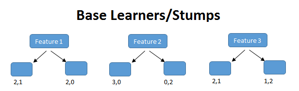

<div class="watermark"></div>

# Bagging & Boosting

El *bagging o agregación bootstrap*, **es un método de aprendizaje por conjuntos que se usa comúnmente para reducir la varianza dentro de un conjunto de datos ruidoso**. En este método, se selecciona una muestra aleatoria de datos en un conjunto de entrenamiento con reemplazo, lo que significa que los puntos de datos individuales se pueden elegir más de una vez. Después de generar varias muestras de datos, estos modelos se entrenan de forma independiente y, según el tipo de tarea (regresión o clasificación), el promedio o la mayoría de esas predicciones producen una estimación más precisa.

```{r echo=FALSE,fig.align='center', out.height='500pt', out.width='900pt'}
knitr::include_graphics("img/05-bagging/bagging.jpeg")
```

**Nota:** El algoritmo de bosque aleatorio se considera una extensión del método de bagging, utilizando tanto bagging como la aleatoriedad de características para crear un bosque no correlacionado de árboles de decisión.


## Aprendizaje conjunto

El aprendizaje conjunto da crédito a la idea de la “sabiduría de las multitudes”, lo que sugiere que **la toma de decisiones de un grupo más grande de individuos (modelos) suele ser mejor que la de un individuo.**

El aprendizaje en conjunto **es un grupo (o conjunto) de individuos o modelos, que trabajan colectivamente para lograr una mejor predicción final**. Un solo modelo, también conocido como aprendiz básico puede no funcionar bien individualmente debido a una gran variación o un alto sesgo, sin embargo, cuando se agregan individuos débiles, pueden formar un individuo fuerte, ya que su combinación reduce el sesgo o la varianza, lo que produce un mejor rendimiento del modelo.

```{r echo=FALSE,fig.align='center', out.height='350pt', out.width='600pt'}
knitr::include_graphics("img/05-bagging/ramitas.jpg")
```

Los métodos de conjunto se ilustran con frecuencia utilizando árboles de decisión, ya que este algoritmo puede ser propenso a sobreajustar (alta varianza y bajo sesgo) y también puede prestarse a desajuste (baja varianza y alto sesgo) cuando es muy pequeño, como un árbol de decisión con un nivel. 

**Nota:** Cuando un algoritmo se adapta o no se adapta a su conjunto de entrenamiento, no se puede generalizar bien a nuevos conjuntos de datos, por lo que se utilizan métodos de conjunto para contrarrestar este comportamiento y permitir la generalización del modelo a nuevos conjuntos de datos.

## Bagging vs. boosting

*Bagging* y el *boosting (refuerzo o impulso)* son dos tipos principales de métodos de aprendizaje por conjuntos. La principal diferencia entre estos métodos de aprendizaje es la forma en que se capacitan. 

En **_bagging_, los modelos se entrenan en paralelo, pero en el _boosting_, aprenden secuencialmente.** Esto significa que se construyen una serie de modelos y con cada nueva iteración del modelo, se incrementan los pesos de los datos clasificados erróneamente en el modelo anterior. Esta redistribución de pesos ayuda al algoritmo a identificar los parámetros en los que necesita enfocarse para mejorar su desempeño.

```{r echo=FALSE,fig.align='center', out.height='350pt', out.width='600pt'}
knitr::include_graphics("img/05-bagging/bagging-boosting.jpeg")
```

Un ejemplo de modelo secuencial es: **Adaboost** y significa "algoritmo de boosting adaptativo", es uno de los algoritmos de boosting más populares, ya que fue uno de los primeros de su tipo. Otros tipos de algoritmos de booting incluyen **XGBoost**, *GradientBoost* y *BrownBoost*.

Otra diferencia en la que difieren *bagging* y *boosting* son los escenarios en los que se utilizan. Por ejemplo, los métodos de *bagging* se utilizan típicamente en modelos débiles que exhiben alta varianza y bajo sesgo, mientras que los métodos de *boosting* se aprovechan cuando se observa baja varianza y alto sesgo.

::: {.infobox .note data-latex="{note}"}
**¡¡ RECORDAR !!**

Bagging realiza replicaciones bootstrap y ajusta un árbol a cada muestra de manera independiente, mientras que boosting ajusta un árbol a una versión modificada del conjunto original de datos, la cual se modifica en cada iteración de entrenamiento.
:::

### Error Out-Of-Bag

Este error es conocido como "OOB". Se trata de un enfoque distinto a KFCV en donde el error predictivo es calculado a través de los elementos que **no fueron seleccionados** en la muestra bootstrap. Recordemos que en las muestras bootstrap algunos elementos son seleccionados más de una vez, mientras que otros no aparecen en la muestra. Empíricamente, en cada replicación bootstrap se observan 2/3 partes de la muestra y el resto queda "fuera de la bolsa" (OOB) de entrenamiento. 

Si **B** es el número de replicaciones bootstrap, entonces cada observación *i* recibe cerca de B/3 predicciones, las cuales son usadas para estimar el error predictivo. Para obtener una única predicción en cada observación, las B/3 predicciones son promediadas.

## Algoritmo Bagging

1. **Bootstrapping**: *Bagging* aprovecha una técnica de muestreo de *bootstrapping* para crear muestras diversas. Este método de remuestreo genera diferentes subconjuntos a partir del conjunto de datos de entrenamiento original seleccionando puntos de datos al azar y con reemplazo. Esto significa que cada vez que selecciona un punto del conjunto de entrenamiento, puede seleccionar la misma instancia varias veces. Como resultado, un valor se repite dos veces (o más) en una muestra y algunos no aparecen.

2. **Entrenamiento paralelo**: estos ejemplos de *bootstrap* se entrenan de forma independiente y en paralelo entre sí utilizando modelos débiles o básicos.

3. **Agregación**: Finalmente, dependiendo de la tarea (regresión o clasificación), se toma un promedio o la mayoría de las predicciones para calcular una estimación más precisa. En el caso de la regresión, se toma un promedio de todos los resultados predichos por los clasificadores individuales; esto se conoce como **votación suave**. 

Para problemas de clasificación, se acepta la clase con mayor mayoría de votos; esto se conoce como **votación en firme o votación por mayoría**.

### Ventajas y desventajas de bagging

Hay una serie de ventajas y desventajas clave que presenta el método de bagging cuando se usa para problemas de clasificación o regresión. 

**Ventajas**

* **Facilidad de implementación**: las bibliotecas de *R* como *tidymodels* facilitan la combinación de las predicciones de los aprendices o estimadores base para mejorar el rendimiento del modelo. 

* **Reducción de varianza**: bagging puede reducir la varianza dentro de un algoritmo de aprendizaje. Esto es particularmente útil con datos de alta dimensión, donde los valores faltantes pueden conducir a una mayor varianza, lo que los hace más propensos a sobreajustarse y evitar la generalización precisa a nuevos conjuntos de datos.


**Desventajas**

* **Pérdida de interpretabilidad**: es difícil obtener información empresarial muy precisa a través del bagging debido al promedio involucrado en las predicciones. Si bien el resultado es más preciso que cualquier punto de datos individual, un conjunto de datos más exacto o completo también podría producir más precisión dentro de un solo modelo de clasificación o regresión.

* **Computacionalmente costoso**: *bagging* se ralentiza y se vuelve más intensivo a medida que aumenta el número de iteraciones. Por lo tanto, no es adecuado para aplicaciones en tiempo real. Los sistemas agrupados o una gran cantidad de núcleos de procesamiento son ideales para crear rápidamente conjuntos en bolsas en conjuntos de prueba grandes.

* **Menos flexible**: como técnica, *bagging* funciona particularmente bien con algoritmos que son menos estables. Uno que sea más estable o esté sujeto a grandes cantidades de sesgo no proporciona tanto beneficio ya que hay menos variación dentro del conjunto de datos del modelo. 

### Aplicaciónes de Bagging

La técnica de *bagging* se utiliza en una gran cantidad de industrias, proporcionando información sobre el valor del mundo real y perspectivas interesantes. Los casos de uso clave incluyen:

* **TI**: *bagging* también puede mejorar la precisión y exactitud en los sistemas de TI, como los sistemas de detección de intrusiones en la red. 

* **Medio ambiente**: los métodos de conjunto, como bagging, se han aplicado en el campo de la teledetección (técnica de adquisición de datos de la superficie terrestre desde sensores instalados en plataformas espaciales).

* **Finanzas**: *bagging* también se ha aprovechado con modelos de aprendizaje profundo en la industria financiera, automatizando tareas críticas, incluida la detección de fraudes, evaluaciones de riesgo crediticio y problemas de precios de opciones.


### Implementación en *R*

```{r, warning=FALSE, message=FALSE}
library(tidymodels)
library(rsample)
data(ames)

set.seed(20211212)
ames_boot <- bootstraps(ames, times = 500, apparent = TRUE) 
# Se crean muestras bootstrap
```


```{r}
# Se entrena un modelo para cada muestra. 
ames_models <- ames_boot %>%
  mutate(
    model = map(
     splits, ~ lm(Sale_Price ~ 0 + log10(Gr_Liv_Area) + Full_Bath + Year_Built, 
                  data = .)),
    coef_info = map(model, tidy)
  )

ames_coefs <- ames_models %>% unnest(coef_info)
ames_coefs
```

```{r, message=FALSE, warning=FALSE}
# Evaluación de resultados 

ames_coefs %>%
  ggplot(aes(estimate)) +
  geom_histogram(fill = "light blue")+
  facet_wrap(~term, scales = "free_x")+
  scale_x_continuous(labels = comma)+
  theme_minimal()

```


## Algoritmo Boosting

Tradicionalmente, la construcción de una aplicación de aprendizaje automático consistía en tomar un solo estimador, es decir:

* Un regresor logístico
* Un árbol de decisión
* Una máquina de vectores de soporte 
* Una red neuronal artificial

Para posteriormente ser entrenado por un conjunto de datos. 

Luego nacieron los **métodos de conjunto**, los cuales pueden describirse como **técnicas que utilizan un grupo de modelos "débiles" juntos, con el fin de crear uno más fuerte y agregado**. 

El *Boosting* consiste en la idea de filtrar o **ponderar los datos** que se utilizan para capacitar a nuestro conjunto de modelos "débiles", para que **cada nuevo modelo pondere o "solo se entrene" con observaciones que han sido mal clasificadas por los anteriores modelos.**


```{r echo=FALSE,fig.align='center', out.height='400pt', out.width='800pt'}
knitr::include_graphics("img/05-bagging/boosting2.png")
```


Al hacer esto, nuestro conjunto de modelos aprende a hacer predicciones precisas sobre todo tipo de datos, no solo sobre las observaciones más comunes o fáciles. Además, si uno de los modelos individuales es muy malo para hacer predicciones sobre algún tipo de observación, no importa, ya que los otros $N - 1$ modelos  probablemente lo compensarán.


```{r echo=FALSE,fig.align='center', out.height='250pt', out.width='600pt'}
knitr::include_graphics("img/05-bagging/boosting.png")
```

Como se puede ver en la imagen anterior, en *boosting* el conjunto de datos se pondera (representado por los diferentes tamaños de los datos), de modo que las observaciones que fueron clasificadas incorrectamente por el clasificador $n$ reciben más importancia en el entrenamiento del modelo $n + 1$. En general, **los métodos de conjunto reducen el sesgo y la varianza de nuestros modelos de aprendizaje automático**.

::: {.infobox .note data-latex="{note}"}
**¡¡ RECORDAR !!**

Los modelos bootstrap buscan aprender lentamente patrones relevantes a lo largo de muchas iteraciones, de forma que se vaya haciendo un ajuste lento pero preciso.
:::

El proceso de entrenamiento depende del algoritmo *boosting* que estemos usando *(Adaboost, LigthGBM, XGBoost, $\dots$)*, pero generalmente sigue este patrón:

1. Todas las muestras de datos comienzan con los mismos pesos. Estas muestras se utilizan para entrenar un modelo individual (digamos un árbol de decisión).

2. Se calcula el error de predicción para cada muestra, **aumentando los pesos de aquellas muestras que han tenido un error mayor**, para hacerlas más importantes para el entrenamiento del siguiente modelo individual.

3. Dependiendo de qué tan bien le fue a este modelo individual en sus predicciones, se le asigna una importancia/peso. 

4. Los datos ponderados se pasan al modelo posterior y se repiten lo pasos 2) y 3). Este paso se repite hasta que se haya alcanzado un cierto número de modelos o hasta que el error esté por debajo de un cierto umbral.

```{r echo=FALSE,fig.align='center', out.height='350pt', out.width='600pt'}
knitr::include_graphics("img/05-bagging/boosting-training.png")
```

En algunos casos, los modelos de *boosting* se entrenan con un peso fijo específico para cada modelo (llamado tasa de aprendizaje) y en lugar de dar a cada muestra un peso individual, los modelos se entrenan tratando de predecir las diferencias entre las predicciones anteriores en las muestras y los valores reales de la variable objetivo. Esta diferencia es conocida como residuales.

La forma de ajustar el modelo sigue los siguientes pasos:

1. Se fija $\hat{f}(x)=0$ y $r_i=y_i$ para todos los elementos del conjunto de entrenamiento

2. Para $b=1,2,...,B$, repetir:

  a) Ajustar un árbol $\hat{f}^b$ al conjunto de entrenamiento $(X, r)$
 
  b) Actualizar el ajuste $\hat{f}(x)$ al añadir una nueva versión restringida de un nuevo árbol:
 
 $$\hat{F}_b(X) \leftarrow \hat{F}_{b-1}(X) + \lambda_b\hat{h}_b(X, r_{b-1})$$
  c) Actualizar los residuos:
 
 $$r_b \leftarrow r_{b-1} - \lambda_b\hat{f}^b(x_i)$$

3. Resultado del modelo *Boosting*:

$$\hat{F}=\sum_{b=1}^{B}\lambda_b\hat{F}_b(x)$$
Para calcular $\lambda_b$ en cada iteración, se usa la siguiente fórmula:

$$\underset{\alpha}{\operatorname{argmin}}=\sum_{i=1}^{b}{L(Y_i, \hat{F}_{i-1}(X_i)+\lambda \hat{h}_i(X_i, r_{i-1}))}$$
Donde $L(Y, F(X))$ es una función de pérdida diferenciable.


### Predicciones de *Boosting*

La forma en que un modelo de *boosting* hace predicciones sobre nuevos datos es muy simple. Cuando obtenemos una nueva observación con sus características, se pasa a través de cada uno de los modelos individuales, haciendo que cada modelo haga su propia predicción.

Luego, teniendo en cuenta el peso de cada uno de estos modelos, todas estas predicciones se escalan y combinan, y se da una predicción global final.

```{r echo=FALSE,fig.align='center', out.height='350pt', out.width='610pt'}
knitr::include_graphics("img/05-bagging/boosting-predicciones.png")
```


### Modelos *Boosting*

**XGBoost**

Abreviatura de *eXtreme Gradient Boosting*, como en *Gradient Boosting*, ajustamos los árboles a los residuos de las predicciones de árboles anteriores, sin embargo, en lugar de usar árboles de decisión de tamaño fijo convencionales, **_XGBoost_ usa un tipo diferente de árboles**.

Estos árboles se construyen calculando puntuaciones de similitud entre las observaciones que terminan en un nodo de salida. Además, *XGBoost* permite la regularización, reduciendo el posible sobreajuste de nuestros árboles individuales y, por lo tanto, del modelo de conjunto general.

Por último, *XGBoost* está optimizado para superar el límite de los recursos computacionales de los algoritmos de árbol impulsados, lo que lo convierte en un algoritmo rápido y de muy alto rendimiento en términos de tiempo y cálculo.

```{r echo=FALSE,fig.align='center', out.height='400pt', out.width='800pt'}
knitr::include_graphics("img/05-bagging/sequential_trees.png")
```


**Adaboost**

Abreviatura de *Adaptive Boosting, AdaBoost* funciona mediante el proceso descrito anteriormente de entrenar secuencialmente, predecir y actualizar los pesos de las muestras mal clasificadas y de los modelos débiles correspondientes.

Se usa principalmente con *Decision Tree Stumps*: árboles de decisión con solo un nodo raíz y dos nodos de salida, donde solo se evalúa una característica de los datos. Como podemos ver, al tener en cuenta solo una característica de nuestros datos para hacer predicciones, cada pivote es un modelo muy débil. Sin embargo, al combinar muchos de ellos, se puede construir un modelo de conjunto muy robusto y preciso.

```{r echo=FALSE,fig.align='center', out.height='350pt', out.width='700pt'}

```


### Implementación en R

### XGBoost para regresión

**Paso 1: Separación inicial de datos (test, train)**

```{r}
library(tidymodels)

data(ames)

set.seed(4595)
ames_split <- initial_split(ames, prop = 0.75)
ames_train <- training(ames_split)
ames_test  <- testing(ames_split)
ames_folds <- vfold_cv(ames_train)
```

Contando con datos de entrenamiento, procedemos a realizar el feature engineering para extraer las mejores características que permitirán realizar las estimaciones en el modelo.

**Paso 2: Pre-procesamiento e ingeniería de variables**

```{r}
receta_casas <- recipe(Sale_Price ~ . , data = ames_train) %>%
  step_unknown(Alley) %>%
  step_rename(Year_Remod = Year_Remod_Add) %>% 
  step_rename(ThirdSsn_Porch = Three_season_porch) %>% 
  step_ratio(Bedroom_AbvGr, denom = denom_vars(Gr_Liv_Area)) %>% 
  step_mutate(
    Age_House = Year_Sold - Year_Remod,
    TotalSF   = Gr_Liv_Area + Total_Bsmt_SF,
    AvgRoomSF   = Gr_Liv_Area / TotRms_AbvGrd,
    Pool = if_else(Pool_Area > 0, 1, 0),
    Exter_Cond = forcats::fct_collapse(Exter_Cond, Good = c("Typical", "Good", "Excellent"))) %>% 
  step_relevel(Exter_Cond, ref_level = "Good") %>% 
  step_normalize(all_predictors(), -all_nominal()) %>%
  step_dummy(all_nominal()) %>% 
  step_interact(~ Second_Flr_SF:First_Flr_SF) %>% 
  step_interact(~ matches("Bsmt_Cond"):TotRms_AbvGrd) %>% 
  step_rm(
    First_Flr_SF, Second_Flr_SF, Year_Remod,
    Bsmt_Full_Bath, Bsmt_Half_Bath, 
    Kitchen_AbvGr, BsmtFin_Type_1_Unf, 
    Total_Bsmt_SF, Kitchen_AbvGr, Pool_Area, 
    Gr_Liv_Area, Sale_Type_Oth, Sale_Type_VWD
  ) %>% 
  prep()

receta_casas
```

Recordemos que la función recipe() solo son los pasos a seguir, necesitamos usar la función prep() que nos devuelve una receta actualizada con las estimaciones y la función juice() que nos devuelve la matriz de diseño.

**Paso 3: Selección de tipo de modelo con hiperparámetros iniciales**

```{r}
xgboost_reg_model <- boost_tree(
  mode = "regression",
  trees = 1000,
  tree_depth = tune(),
  min_n = tune(),
  loss_reduction = tune(),
  sample_size = tune(),
  mtry = tune(),
  learn_rate = tune()
 ) %>% 
  set_engine(
   "xgboost", 
   importance = "impurity"
  )

xgboost_reg_model
```
**Paso 4: Inicialización de workflow o pipeline**

```{r}
xgboost_reg_workflow <- workflow() %>% 
  add_model(xgboost_reg_model) %>% 
  add_recipe(receta_casas)

xgboost_reg_workflow
```
**Paso 5: Creación de grid search**

```{r}
xgboost_param_grid <- grid_latin_hypercube(
  tree_depth(range = c(3, 50)),
  min_n(range = c(2,50)),
  loss_reduction(range = c(-10, 1.5), trans = log10_trans()),
  learn_rate(range = c(-6, -0.25), trans = log10_trans()),
  mtry(range = c(1, 70)),
  sample_size = sample_prop(),
  size = 1000
)

xgboost_param_grid
```
**Paso 6: Entrenamiento de modelos con hiperparámetros definidos**

```{r, eval=FALSE}
UseCores <- detectCores() - 1
cluster <- makeCluster(UseCores)
registerDoParallel(cluster)
ctrl_grid <- control_grid(save_pred = T, verbose = T)

xgb1 <- Sys.time()
xgboost_reg_tune_result <- tune_grid(
  xgboost_reg_workflow,
  resamples = ames_folds,
  grid = xgboost_param_grid,
  metrics = metric_set(rmse, mae, mape, rsq),
  control = ctrl_grid
)
xgb2 <- Sys.time(); xgb2 - xgb1

stopCluster(cluster)

xgboost_reg_tune_result %>% saveRDS("models/xgboost_model_reg.rds")
```

**Paso 7: Análisis de métricas de error e hiperparámetros (Vuelve al paso 3, si es necesario)**

```{r}
xgboost_reg_tune_result <- readRDS("models/xgboost_model_reg.rds")

collect_metrics(xgboost_reg_tune_result)
```

En la siguiente gráfica observamos las distintas métricas de error asociados a los hiperparámetros elegidos:

```{r}
xgboost_reg_tune_result %>% 
 autoplot() 
```

```{r}
show_best(xgboost_reg_tune_result, n = 10, metric = "rsq") %>% 
 select(mtry:sample_size, mean:std_err, -n)
```


**Paso 8: Selección de modelo a usar**

```{r, message=FALSE, warning=FALSE}
best_xgboost_reg_model <- select_best(xgboost_reg_tune_result, metric = "rsq")
best_xgboost_reg_model

best_xgboost_reg_1se_model <- xgboost_reg_tune_result %>% 
 select_by_one_std_err(metric = "rsq", "rsq")
best_xgboost_reg_1se_model
```

**Paso 9: Ajuste de modelo final con todos los datos (Vuelve al paso 2, si es necesario)**

```{r, message=FALSE, warning=FALSE}
final_xgboost_reg_model <- xgboost_reg_workflow %>% 
  #finalize_workflow(best_xgboost_model) %>% 
  finalize_workflow(best_xgboost_reg_1se_model) %>% 
  fit(data = ames_train)

final_xgboost_reg_model
```
Como hemos hablado anteriormente, este último objeto es el modelo final entrenado, el cual contiene toda la información del pre-procesamiento de datos, por lo que en caso de ponerse en producción el modelo, sólo se necesita de este último elemento para poder realizar nuevas predicciones.

Antes de pasar al siguiente paso, es importante validar que hayamos hecho un uso correcto de las variables predictivas. En este momento es posible detectar variables que no estén aportando valor o variables que no debiéramos estar usando debido a que cometeríamos data leakage. Para enfrentar esto, ayuda estimar y ordenar el valor de importancia del modelo

```{r}
library(vip)

final_xgboost_reg_model %>%
  extract_fit_parsnip() %>%
  vip::vip(num_features = 25) + 
  ggtitle("Importancia de las variables")
```

**Paso 10: Validar poder predictivo con datos de prueba**

Imaginemos por un momento que pasa un mes de tiempo desde que hicimos nuestro modelo, es hora de ponerlo a prueba prediciendo valores de nuevos elementos:

```{r}
results <- predict(final_xgboost_reg_model, ames_test) %>% 
  dplyr::bind_cols(truth = ames_test$Sale_Price) %>% 
  dplyr::rename(pred_xgb_reg = .pred, Sale_Price = truth)

head(results)
```

```{r}
multi_metric <- metric_set(rmse, rsq, mae, mape, ccc)
multi_metric(results, truth = Sale_Price, estimate = pred_xgb_reg) %>% 
  mutate(.estimate = round(.estimate, 2))
```


```{r}
results %>% 
  ggplot(aes(x = pred_xgb_reg, y = Sale_Price)) +
  geom_point() +
  geom_abline(color = "red") +
  xlab("Prediction") +
  ylab("Observation") +
  ggtitle("Comparisson")
```


### XGBoost para clasificación

**Paso 1: Separación inicial de datos (test, train)**

```{r}
set.seed(1234)
telco_split <- initial_split(telco, prop = .70)

telco_train <- training(telco_split)
telco_test  <- testing(telco_split)
telco_folds <- vfold_cv(telco_train)

telco_folds
```

**Paso 2: Pre-procesamiento e ingeniería de variables**

```{r}
binner <- function(x) {
  x <- cut(x, breaks = c(0, 12, 24, 36,48,60,72), include.lowest = TRUE)
  as.numeric(x)
}

telco_rec <- recipe(Churn ~ ., data = telco_train) %>% 
  update_role(customerID, new_role = "id variable") %>% 
  step_num2factor(
    tenure, transform = binner, 
    levels = c("0-1 year", "1-2 years", "2-3 years", "3-4 years", "4-5 years", "5-6 years")) %>%
  step_normalize(all_numeric_predictors()) %>% 
  step_dummy(all_nominal_predictors()) %>% 
  step_impute_median(all_numeric_predictors()) %>% 
  step_rm(customerID, skip=T) %>% 
  prep()

telco_rec
```

**Paso 3: Selección de tipo de modelo con hiperparámetros iniciales**

```{r}

xgboost_model <- boost_tree(
  mode = "classification",
  trees = 1000,
  tree_depth = tune(),
  min_n = tune(),
  loss_reduction = tune(),
  sample_size = tune(),
  mtry = tune(),
 learn_rate = tune()
 ) %>% 
  set_engine(
   "xgboost", 
   importance = "impurity"
  )

xgboost_model
```

**Paso 4: Inicialización de workflow o pipeline**

```{r}
xgboost_workflow <- workflow() %>% 
  add_model(xgboost_model) %>% 
  add_recipe(telco_rec)

xgboost_workflow
```

**Paso 5: Creación de grid search**
```{r}
xgboost_param_grid <- grid_latin_hypercube(
  tree_depth(range = c(2, 30)),
  min_n(range = c(2,50)),
  loss_reduction(range = c(-10, 1.5), trans = log10_trans()),
  learn_rate(range = c(-6, -0.25), trans = log10_trans()),
  mtry(range = c(1, 20)),
  sample_size = sample_prop(),
  size = 500
)

xgboost_param_grid
```


**Paso 6: Entrenamiento de modelos con hiperparámetros definidos**

```{r, eval=FALSE}
library(doParallel)

UseCores <- detectCores() - 1
cluster <- makeCluster(UseCores)
registerDoParallel(cluster)

ctrl_grid <- control_grid(save_pred = T, verbose = T)

xgbt1 <- Sys.time()
xgboost_tune_result <- tune_grid(
  xgboost_workflow,
  resamples = telco_folds,
  grid = xgboost_param_grid,
  metrics = metric_set(roc_auc, pr_auc)
)

xgb2 <- Sys.time(); xgb2 - xgbt1

stopCluster(cluster)

xgboost_tune_result %>% saveRDS("models/xgboost_model_classification.rds")

```

**Paso 7: Análisis de métricas de error e hiperparámetros (Vuelve al paso 3, si es necesario)**

```{r}
xgboost_tune_result <- readRDS("models/xgboost_model_classification.rds")

collect_metrics(xgboost_tune_result)
```

En la siguiente gráfica observamos las distintas métricas de error asociados a los hiperparámetros elegidos:

```{r}
autoplot(xgboost_tune_result)
```

```{r}
show_best(xgboost_tune_result, n = 10, metric = "roc_auc") 
```

```{r}
show_best(xgboost_tune_result, n = 10, metric = "pr_auc") 
```


**Paso 8: Selección de modelo a usar**

```{r, message=FALSE, warning=FALSE}
best_xgboost_model <- select_best(xgboost_tune_result, metric = "pr_auc")
best_xgboost_model

best_xgboost_model_1se <- xgboost_tune_result %>% 
 select_by_one_std_err(metric = "pr_auc", "pr_auc")
best_xgboost_model_1se
```

**Paso 9: Ajuste de modelo final con todos los datos (Vuelve al paso 2, si es necesario)**

```{r, message=FALSE, warning=FALSE}
final_xgboost_model <- xgboost_workflow %>% 
  finalize_workflow(best_xgboost_model) %>% 
  #finalize_workflow(best_xgboost_model_1se) %>% 
  fit(data = telco_test)

final_xgboost_model
```

Como hemos hablado anteriormente, este último objeto es el modelo final entrenado, el cual contiene toda la información del pre-procesamiento de datos, por lo que en caso de ponerse en producción el modelo, sólo se necesita de este último elemento para poder realizar nuevas predicciones.

Antes de pasar al siguiente paso, es importante validar que hayamos hecho un uso correcto de las variables predictivas. En este momento es posible detectar variables que no estén aportando valor o variables que no debiéramos estar usando debido a que cometeríamos data leakage. Para enfrentar esto, ayuda estimar y ordenar el valor de importancia del modelo.

```{r}
library(vip)

final_xgboost_model %>%
  pull_workflow_fit() %>%
  vip::vip() + 
  ggtitle("Importancia de las variables")
```

**Paso 10: Validar poder predictivo con datos de prueba**

Imaginemos por un momento que pasa un mes de tiempo desde que hicimos nuestro modelo, es hora de ponerlo a prueba prediciendo valores de nuevos elementos:

```{r, message=FALSE, warning=FALSE}

class_results <- predict(final_xgboost_model, telco_test, type = "prob") %>%
  bind_cols(Churn = telco_test$Churn) %>% 
   mutate(Churn = factor(Churn, levels = c('No', 'Yes'), labels = c('No', 'Yes'))) 

head(class_results)
```
```{r}
roc_auc(class_results, truth = Churn, estimate = .pred_Yes, event_level = "second")
pr_auc(class_results, truth = Churn, estimate = .pred_Yes, event_level = "second")
```


A continuación, conoceremos el nivel de sensitividad y especificidad para cada punto de corte:

```{r}
roc_curve_data <- roc_curve(
  class_results, 
  truth = Churn, 
  estimate = .pred_Yes, 
  event_level = 'second'
  )

roc_curve_data
```

A través de estas métricas es posible crear la curva ROC:

```{r}
roc_curve_plot <- roc_curve_data %>% 
  ggplot(aes(x = 1 - specificity, y = sensitivity)) +
  geom_path(size = 1, colour = 'lightblue') +
  geom_abline() +
  coord_equal() +
  ggtitle("ROC Curve")+
  theme_minimal()

roc_curve_plot
```

De igual manera, podemos calcular la precisión y cobertura para cada punte de corte:

```{r}
pr_curve_data <- pr_curve(
  class_results, 
  truth = Churn, 
  estimate = .pred_Yes, 
  event_level = 'second'
  )

pr_curve_data
```
Y graficar su respectiva curva:

```{r}
pr_curve_plot <- pr_curve_data %>% 
  ggplot(aes(x = recall, y = precision)) +
  geom_path(size = 1, colour = 'lightblue') +
  coord_equal() +
  ggtitle("Precision vs Recall")+
  theme_minimal()

pr_curve_plot
```


