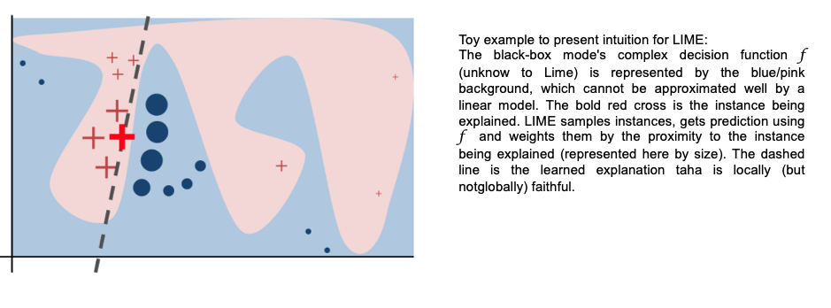
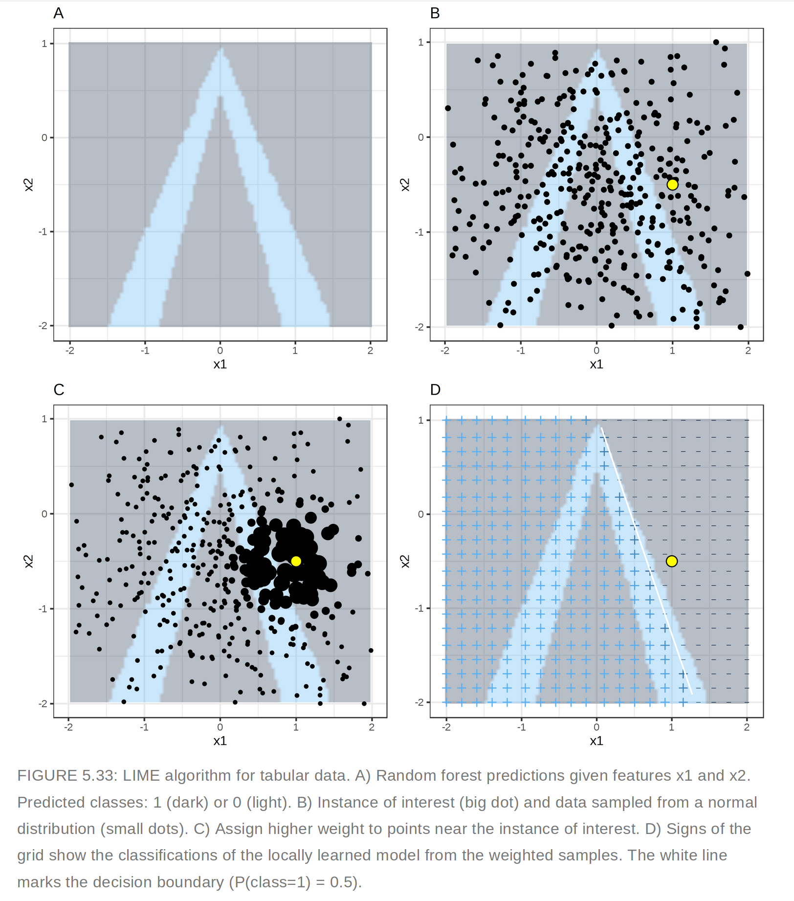
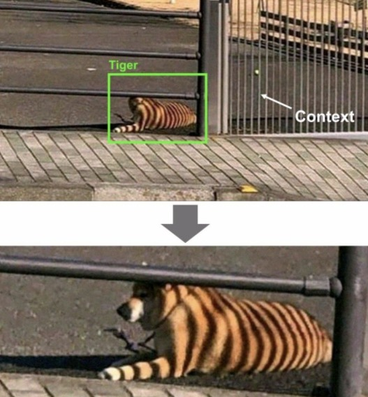
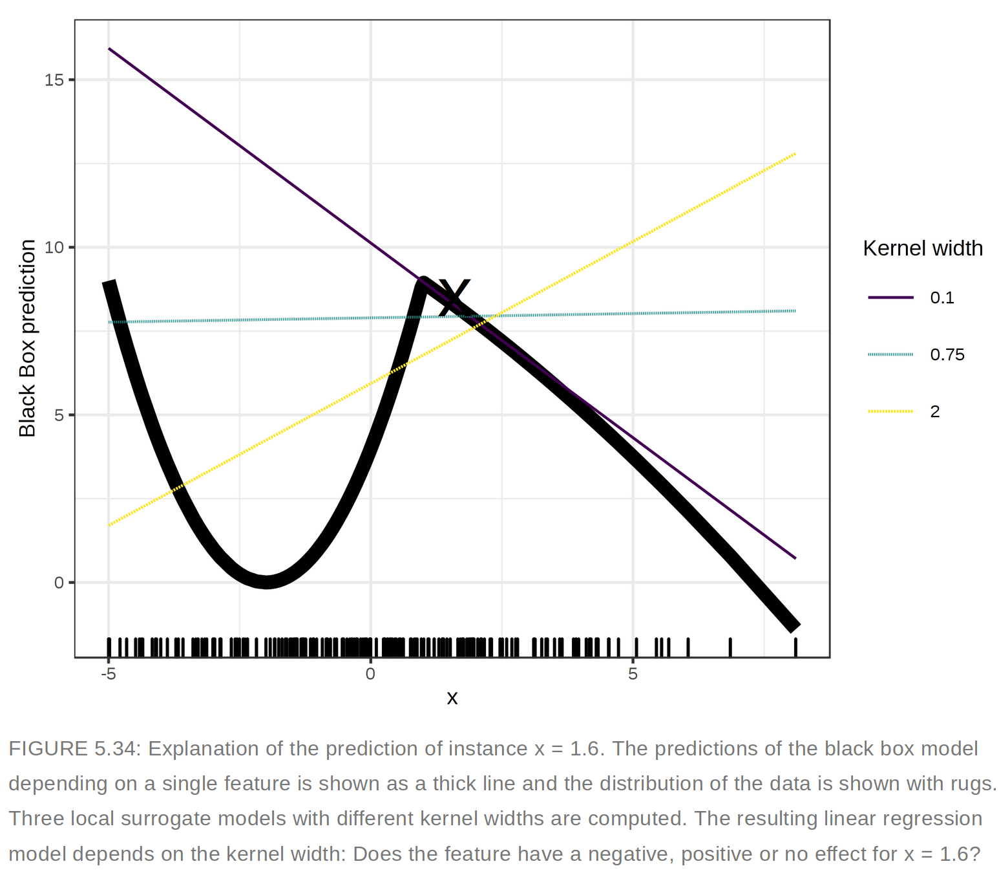

<div class="watermark"></div>

# Interpretabilidad de modelos

```{r, echo=FALSE, message=FALSE}

# Telco
library(readr)
library(rsample)
library(dplyr)
library(tidyverse)
library(tidymodels) 
library(recipes)
library(ggplot2)
library(kableExtra)
library(patchwork)
library(dplyr)
library(forecast)
library(fpp)
library(magrittr)
library(forcats)
library(caret)
library(tune)
library(yardstick)

telco <- read_csv("data/Churn.csv")

set.seed(1234)
telco_split <- initial_split(telco, prop = .7)
telco_train <- training(telco_split)
telco_test  <- testing(telco_split)

binner <- function(x) {
  x <- cut(x, breaks = c(0, 12, 24, 36,48,60,72), include.lowest = TRUE)
  as.numeric(x)
}

telco_rec <- recipe(Churn ~ ., data = telco_train) %>% 
  step_mutate(
   MultipleLines = forcats::fct_collapse(MultipleLines, No = "No phone service"),
   OnlineSecurity = forcats::fct_collapse(OnlineSecurity, No = "No internet service"),
   OnlineBackup = forcats::fct_collapse(OnlineBackup, No = "No internet service"),
   DeviceProtection = forcats::fct_collapse(DeviceProtection, No = "No internet service"),
   TechSupport = forcats::fct_collapse(TechSupport, No = "No internet service"),
   StreamingTV = forcats::fct_collapse(StreamingTV, No = "No internet service"),
   StreamingMovies = forcats::fct_collapse(StreamingMovies, No = "No internet service")) %>%
  step_num2factor(
   tenure, 
   transform = binner, 
   levels = c("0-1 year", "1-2 years", "2-3 years", "3-4 years", "4-5 years", "5-6 years")) %>%
  step_rm(customerID) %>% 
  step_normalize(all_numeric_predictors()) %>%
  step_dummy(all_nominal_predictors()) %>%
  step_impute_median(all_numeric_predictors())

prep_telco <- prep(telco_rec)
telco_juiced <- juice(prep_telco)
telco_train <- telco_rec %>% prep() %>% bake(new_data = telco_train)
```


```{r, echo=FALSE, warning=FALSE}
library(tidymodels)

data(ames)

set.seed(4595)
ames_split <- initial_split(ames, prop = 0.75)
ames_train <- training(ames_split)
ames_test  <- testing(ames_split)
ames_folds <- vfold_cv(ames_train)

receta_casas <- recipe(Sale_Price ~ . , data = ames_train) %>%
  step_unknown(Alley) %>%
  step_unknown(Pool_QC) %>%
  step_unknown(Misc_Feature) %>%
  step_unknown(Fence) %>%
  step_unknown(Garage_Finish) %>%
  step_unknown(Garage_Cond) %>%
  step_unknown(Garage_Type) %>%
  step_unknown(Bsmt_Exposure) %>%
  step_unknown(Bsmt_Cond) %>%
  step_unknown(BsmtFin_Type_1) %>%
  step_unknown(BsmtFin_Type_2) %>%
  step_unknown(Mas_Vnr_Type) %>%
  step_unknown(Electrical) %>%
  step_impute_knn(
    Mas_Vnr_Area, Lot_Frontage, 
    impute_with= all_predictors(),
    neighbors = 5) %>%
  step_rename(Year_Remod = Year_Remod_Add) %>% 
  step_rename(ThirdSsn_Porch = Three_season_porch) %>% 
  step_ratio(Bedroom_AbvGr, denom = denom_vars(Gr_Liv_Area)) %>% 
  step_mutate(
    Age_House = Year_Sold - Year_Remod,
    TotalSF   = Gr_Liv_Area + Total_Bsmt_SF,
    AvgRoomSF   = Gr_Liv_Area / TotRms_AbvGrd,
    Pool = if_else(Pool_Area > 0, 1, 0),
    Exter_Cond = forcats::fct_collapse(Exter_Cond, Good = c("Typical", "Good", "Excellent"))) %>% 
  step_relevel(Exter_Cond, ref_level = "Good") %>% 
  step_normalize(all_predictors(), -all_nominal()) %>%
  step_dummy(all_nominal()) %>% 
  step_interact(~ Second_Flr_SF:First_Flr_SF) %>% 
  step_interact(~ matches("Bsmt_Cond"):TotRms_AbvGrd) 

receta_casas_prep <- receta_casas %>% prep()
```

**Interpretabilidad:** El grado en el que un humano puede entender la causa de una decisión.

* Nos permite identificar y evitar tener sesgo, injusticia, inequidad en los modelos que generamos.

* Poder interpretar nuestros modelos nos brinda como científicos de datos más confianza en que lo que estamos haciendo lo estamos haciendo correctamente -además de las métricas de desempeño-. Por otro lado, para la gente que lo ocupa, permite transparentar y tener más confianza al modelo.

**Ejemplos**

* Etiquetado: Google photos (2015) etiqueta incorrectamente personas afroamericanas como gorillas.

* Facial Recognition (IBM, Microsoft, Megvii): Reconocimiento para hombres blancos 99%, mujeres afroamericanas 35%.

* Facebook automatic translation: Arresto de un palestino por traducción incorrecta de "buenos días" en hebreo a "atácalos".


**Interpretabilidad en ML**

* General Data Protection Regulation (GDPR): Desde mayo de 2018 existe el right to explanation. Por ejemplo: Algoritmos de predicción de riesgo en créditos hipotecarios.

* Se puede tener interpretabilidad de modelos de aprendizaje supervisado.

* Se tiene la creencia equivocada de que en Europa no se puede ocupar Deep Learning debido a la falta de interpretabilidad y el GDPR. Esto no es verdad.

* Es verdad que preferimos ocupar modelos más simples porque nos permiten entender -y explicar- de manera más sencilla por qué se están tomando las decisiones.

* Te recomiendo leer el artículo Why should I trust you? (2016) base de mucho de lo desarrollado para interpretabilidad.

## LIME

* Acrónimo de *Local Interpretable Model-Agnostic Explanation*

* El objetivo es tener explicacion que un humano pueda entender sobre cualquier modelo supervisado a través de un modelo local más simple.

* La explicación se genera para cada predicción realizada.

* Esta basado en la suposición de que un modelo complejo es lineal en una escala local.

En el contexto de LIME:

* Local: Se refiere a que un modelo simple es lo suficientemente bueno/igual de bueno localmente que uno complejo globalmente Why should I trust you?.

* Interpretable: Se refiere a que la explicación debe ser entendida por un ser humano.

* Model-agnostic: Se refiere a tratar a un cualquier modelo de clasificación, complejo o no, como una caja negra a la que metemos observaciones y obtenemos predicciones, no nos interesa cómo genera estas predicciones, lo que nos interesa es generarlas.

```{r echo=FALSE,fig.align='center', out.width='420pt', out.height='600pt'}

```


### Proceso

El objetivo de *LIME* es entender por qué el modelo de machine learning hace cierta predicción, para ello *LIME* prueba quá pasa con las predicciones si le brindamos
al modelo las mismas observaciones pero con variaciones.

* Genera un nuevo set de datos que consiste de una muestra permutada con sus predicciones originales.

* Con este nuevo set *LIME* entrena un modelo interpretable que puede ser:
  * regresión lineal como LASSO
  * regresión logística
  * árboles de decisión
  * Naive Bayes
  * K-NN.
  
* Este modelo interpretable es ponderado por la proximidad de las observaciones en la muestra a la instancia de interés -la predicción que queremos explicar-.

* El modelo generado debe ser una buena aproximación al modelo de caja negra localmente, pero no necesariamente en forma global. A esto se le llama *local fidelity*.

Para entrenar el modelo interpertable:

**Nosotros:**

* Seleccionamos la observación de la que queremos una explicación.

* Seleccionamos un tamaño de vecindad $k$ para que *LIME* ajuste el modelo.

* Seleccionamos el número de features más importantes con los que queremos realizar la explicación -se recomienda que sea menor a $10$-.

*LIME* genera perturbaciones en una muestra de datos del conjunto de datos

* Texto: "Agrega" o "quita" palabras del texto original aleatoriamente.

* Imágenes: "Apaga" y "prende" pixeles de la imágen original.

* Datos tabulares: De cada feature genera nuevas muestras tomadas de una distribución normal con la $\mu$ y $\sigma$ del feature.

* Las observaciones más "cercanas" definidas por la vecindad k tendrán más peso que el resto. *LIME* ocupa un kernel de suavizamiento exponencial.

* Una $k$ pequeña significa que la observación debe estar muy cercana a la instancia de interés para influenciar el modelo local a generar.

* Una $k$ grande significa que las observaciones más alejadas a la instancia de interés influenciarán el modelo local a generar.

* La implementación de *LIME* ocupa como kernel $0.75$ veces la raíz cuadrada del número de features que tenga nuestro dataset. ¿Eso es bueno o malo? Hasta el momento no hay una justificación matemática o estadística que justifique el definir ese número.

* Obtiene las predicciones del modelo de caja negra para las observaciones generadas en el paso $3$.

* Calcula las distancias entre la predicción original y las obtenidas con los datos modificados.

  * Datos tabulares: Distancia euclidiana por default.

  * Datos numéricos: Se obtiene la media y desviación estándar y se discretiza a sus cuartiles.

  * Datos categóricos: Se calcula la frecuencia de cada valor.

* Texto: Distancia coseno.

* Imágenes: Distancia euclidiana.

* Convierte la distancia a un score de similitud.

    * Datos tabulares: Utiliza el kernel k de suavizamiento exponencial.
    * Texto: Distancia coseno.
    * Imágenes:
      * Genera un modelo simple con los datos modificados
      * Selecciona las $m$ mejores características -depende del modelo utilizado para crear el modelo de interpretabilidad- como explicación para la predicción del modelo de caja negra.

**LIME en datos tabulares**
```{r echo=FALSE,fig.align='center', out.height='600pt', out.width='420pt'}

```

**LIME en texto**
```{r echo=FALSE,fig.align='center', out.height='120', out.width='600pt'}
knitr::include_graphics("img/08-lime/lime_text.png")
```

```{r echo=FALSE,fig.align='center', out.height='200pt', out.width='600pt'}
knitr::include_graphics("img/08-lime/lime_text_2.png")
```

La columna de probabilidad corresponde a la probabilidad de que el enunciado sea Spam o no. La columna peso corresponde a la proximidad del enunciado con variación al enunciado original y está calculado como 1 menos la proporción de palabras que fueron eliminadas.

Por ejemplo: Si una de 7 palabras fueron removidas, el peso correspondería a: $1- 1/7=0.86$.

Al pasar dos enunciados al modelo de interpretabilidad se identifica que para los casos donde está la palabra *channel!* el enunciado será clasificado como spam que es el feature con mayor peso para la etiqueta spam.

```{r echo=FALSE,fig.align='center', out.height='210', out.width='600'}
knitr::include_graphics("img/08-lime/lime_text_3.png")
```

**LIME en imágenes**

```{r echo=FALSE,fig.align='center', out.height='250pt', out.width='600pt'}
knitr::include_graphics("img/08-lime/frog_lime.png")
```
```{r echo=FALSE,fig.align='center', out.height='250pt', out.width='400pt'}
knitr::include_graphics("img/08-lime/huskie_lime.png")
```
```{r echo=FALSE,fig.align='center', out.height='400pt', out.width='400pt'}

```

### Características principales

* Vecindad: $k$, kernel con suavizamiento exponencial. Peso de influencia
* Similitud: Con respecto a las observaciones originales.
* Selección de variables: Las variables que explican la predicción generada.

**Ventajas:**

* Fácil de implementar.
* Se puede ocupar en datos tabulares, imágenes y texto.
* Existen paquetes de implementación para R (lime) y Python (lime).
* Las explicaciones son cortas -pocos features-, por lo que son más fáciles de entender por un humano -no entrenado en machine learning.
* La métrica de *fidelity* nos permite identificar qué tan confiable es el modelo de interpretabilidad en explicar las predicciones del modelo de caja negra en las vecindad del punto de interés.
* Se pueden ocupar otros features en el modelo de interpretabilidad que los ocupados para entrenar el de caja negra. Por ejemplo: Un modelo de clasificación de texto puede utilizar word embeddings, y el de interpretabilidad solo la ausencia o presencia de palabras en el texto.

**Desventajas:**

* La selección correcta de vecindad es el problema más grave de *LIME*.
Para minimizar este problema deberemos probar con diferentes $k$ y ver cuál(es) son las de mayor sentido.

* Variación de las observaciones originales: ¿Qué tal que la distribución no es normal? Al muestrear de una distribución gausiana podemos ignorar correlaciones entre features.

* Dependiendo del tamaño de la $k$ tendremos resultados muy diferentes. Este es el mayor problema de *LIME*.

```{r echo=FALSE,fig.align='center', out.height='350pt', out.width='600pt'}

```


### Implementación con *R*

```{r, message=FALSE, warning=FALSE}
library(lime)
library(pdp)
library(vip)
library(randomForest)
```


```{r, message=FALSE, warning=FALSE}
set.seed(123)

model_rf <- randomForest(
 x = dplyr::select(telco_train, -Churn),
 y = telco_train$Churn, 
 ntree = 100
 )
```

```{r, warning=FALSE, message=FALSE}
explainer_caret <- lime::lime(dplyr::select(telco_train, -Churn), model_rf)
```

Veamos cómo llegaron a ser la predicciones, usando *Lime*.

```{r}
model_type.randomForest <- function(x,...){
  return("classification") # for classification problem
}

predict_model.randomForest <- function(x, newdata, type = "prob") {
    # return prediction value
    predict(x, newdata, type = type) %>% as.data.frame()
}
```

```{r}
set.seed(123)

new_data <- telco_train %>% dplyr::select(-Churn) %>% .[2,]
new_data %>% t()

explanation <- lime::explain(
 x = new_data, 
 explainer = explainer_caret, 
 feature_select = "auto",      # Method of feature selection for lime
 n_features = 10,              # Number of features to explain the model
 n_labels = 1
 )

explanation
```


Para obtener una representación más intuitiva, podemos usar `plot_features()` 
proporcionado para obtener una descripción visual de las explicaciones.

```{r}
plot_features(explanation, ncol = 2)
```


## DALEXtra

El marco *tidymodels* no contiene software para explicaciones de modelos. En cambio, los modelos entrenados y evaluados con *tidymodels* se pueden explicar con paquetes complementarios como *lime*, *vip* y *DALEX*:

* *vip*: funciones cuando queremos usar métodos basados en modelos que aprovechan la estructura del modelo (y a menudo son más rápidos)

* *DALEX*: funciones cuando queremos usar métodos independientes del modelo que se pueden aplicar a cualquier modelo.

Construyamos explicaciones independientes del modelo de regresión de bosques 
aleatorios para descubrir por qué hacen las predicciones que hacen. Podemos usar el paquete adicional *DALEXtra* para *DALEX*, que brinda soporte para *tidymodels*. 

```{r, warning=FALSE}
# Se declara el modelo de clasificación

xgboost_reg_model <- boost_tree(
  mode = "regression",
  trees = 1000,
  tree_depth = tune(),
  min_n = tune(),
  loss_reduction = tune(),
  sample_size = tune(),
  mtry = tune(),
  learn_rate = tune()
 ) %>% 
  set_engine(
   "xgboost", 
   importance = "impurity"
  )

# Se declara el flujo de trabajo
xgboost_workflow <- workflow() %>%
  add_model(xgboost_reg_model) %>%
  add_recipe(receta_casas_prep)

xgboost_tune_result <- readRDS("models/xgboost_model_reg.rds")

best_xgboost_model_1se <- select_by_one_std_err(
  xgboost_tune_result, metric = "rsq", "rsq")

# Selección del mejor modelo
final_xgboost_model <- xgboost_workflow %>%
  finalize_workflow(best_xgboost_model_1se) %>%
  fit(data = ames_train)

```

```{r, message=TRUE, warning=FALSE}
library(DALEXtra)

explainer_xgb <- explain_tidymodels(
 final_xgboost_model,
 data = ames_train, 
 y = ames_train$Sale_Price ,
 label = "XGBoost",
 verbose = TRUE
 )

explainer_xgb
```


Las explicaciones del modelo local proporcionan información sobre una predicción para una sola observación. Por ejemplo, consideremos una casa dúplex antigua
en el vecindario de North Ames.

```{r}
duplex <- ames_train[537,]

duplex %>% 
 dplyr::select("Neighborhood", "Gr_Liv_Area", "Year_Built", 
               "Bldg_Type", "Latitude", "Longitude") %>% 
 glimpse()
```

Existen múltiples enfoques para comprender por qué un modelo predice un precio determinado para esta casa dúplex.

Una se denomina explicación de "desglose" y calcula cómo las contribuciones atribuidas a características individuales cambian la predicción del modelo medio para una observación en particular, como nuestro dúplex.

Para el modelo lide bosques aleatorios, las variables `Total_Bsmt_SF`, `Gr_Liv_Area` y `BsmtFin_Type_1` son las que más contribuyen a que el precio baje desde la intercepción.

```{r, eval=FALSE}
xgb_breakdown <- predict_parts(explainer = explainer_xgb, new_observation = duplex)

xgb_breakdown %>% saveRDS("models/xgb_breakdown.rds")
```

```{r}
xgb_breakdown <- readRDS('models/xgb_breakdown.rds')
xgb_breakdown %>% head(10)
```


La idea detrás de *Shapley Additive Explanations (Lundberg y Lee 2017)*, es que las contribuciones promedio de las características se calculan bajo diferentes combinaciones o "coaliciones" de ordenamientos de características. 

Calculemos las atribuciones *SHAP* para nuestra *dúplex*, usando `B = 20` ordenaciones aleatorias.

```{r, eval=FALSE}
set.seed(1801)

shap_duplex <- predict_parts(
 explainer = explainer_xgb, 
 new_observation = duplex, 
 type = "shap",
 B = 20
 )

shap_duplex %>% saveRDS('models/shap_duplex.rds')
```

Podríamos usar el método de trazado predeterminado de *DALEX* llamando a `plot(shap_duplex)`, o podemos acceder a los datos subyacentes y crear un trazado personalizado. Los diagramas de caja de la figura siguiente muestran la distribución de las contribuciones en todos los ordenamientos que probamos, y las barras muestran la atribución promedio para cada variable.

```{r}
shap_duplex <- readRDS('models/shap_duplex.rds')

shap_duplex <- shap_duplex %>% head(25) # Primeras 25 variables con más contribución 

shap_duplex %>% 
  group_by(variable) %>%
  mutate(mean_val = mean(contribution)) %>%
  ungroup() %>%
  mutate(variable = fct_reorder(variable, abs(mean_val))) %>%
  ggplot(aes(contribution, variable, fill = mean_val > 0)) +
  geom_col(data = ~distinct(., variable, mean_val), 
           aes(mean_val, variable), 
           alpha = 0.5) +
  geom_boxplot(width = 0.5) +
  theme(legend.position = "none") +
  scale_fill_viridis_d() +
  labs(y = NULL) + 
  theme_minimal()
```

¿Qué pasa con una observación diferente en nuestro conjunto de datos? Veamos una casa unifamiliar más grande y nueva en el vecindario de Gilbert.

```{r}
big_house <- ames_train[1671,]
big_house %>% dplyr::select("Neighborhood", "Gr_Liv_Area", "Year_Built", 
                  "Bldg_Type", "Latitude", "Longitude")
```

Calculamos las atribuciones promedio *SHAP* de la misma manera.

```{r, eval=FALSE}
set.seed(1802)

shap_house <- predict_parts(
 explainer = explainer_xgb, 
 new_observation = big_house, 
 type = "shap",
 B = 20
 )

shap_house %>% saveRDS('models/shap_house.rds')

```

```{r}

shap_house <- readRDS('models/shap_house.rds')

shap_house <- shap_house %>% head(25) # Primeras 25 variables con más contribución 

shap_house %>% 
  group_by(variable) %>%
  mutate(mean_val = mean(contribution)) %>%
  ungroup() %>%
  mutate(variable = fct_reorder(variable, abs(mean_val))) %>%
  ggplot(aes(contribution, variable, fill = mean_val > 0)) +
  geom_col(data = ~distinct(., variable, mean_val), 
           aes(mean_val, variable), 
           alpha = 0.5) +
  geom_boxplot(width = 0.5) +
  theme(legend.position = "none") +
  scale_fill_viridis_d() +
  labs(y = NULL) + 
  theme_minimal()

```

A diferencia del dúplex, el tipo de edificio `Bldg_Type` y la chimenea `Fireplaces` de esta casa contribuyen a que su precio sea más alto.

Los paquetes como *DALEX* y su paquete de soporte *DALEXtra* y *lime* se pueden integrar en un análisis de *tidymodels* para proporcionar este tipo de explicativos de modelos. 

Las explicaciones del modelo son solo una parte de la comprensión de si su modelo es apropiado y efectivo, junto con las estimaciones del rendimiento del modelo.

#### Otros métodos

* *Partial Dependence Plot (PDP)*. Efecto marginal de una o dos variables en la predicción.
* *Accumulated Local Effects (ALE)*. Cómo las variables influyen en promedio a la predicción.

#### Consejos

* Trata cada modelo que desarrollas como una afectación de vida o muerte a un humano directamente.
* Identifica si estas agregando sesgo, inequidad, injusticia con interpretabilidad.
* Siempre que tengas un modelo de aprendizaje supervisado ocupa interpretabilidad en tu proceso de desarrollo.
* Siempre que tengas un modelo de aprendizaje supervisado genera interpretabilidad para el usuario final.


