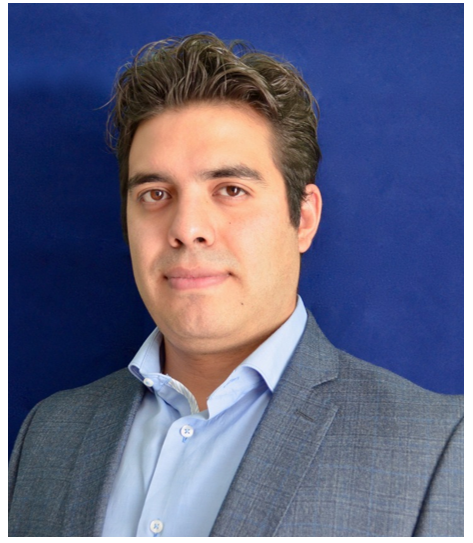

--- 
title: AMAT- Ciencia de Datos y Machine Learning 2
author:
  - Karina Lizette Gamboa Puente
  - Oscar Arturo Bringas López
institute: "AMAT"
site: bookdown::bookdown_site
documentclass: book
bibliography: [book.bib, packages.bib]
biblio-style: apalike
link-citations: yes
description: "AMAT Curso 2 : Ciencia de Datos y Machine Learning 2"
always_allow_html: true

---


# BIENVENIDA 

## Objetivo

Desarrollar conocimiento y habilidades para implementar modelos complejos de Machine Learning a través de un flujo de trabajo limpio, ordenado y sistematizado a mediante las librerías en *R* más novedosas que han sido desarrolladas hasta el momento. Al finalizar este curso, el participante será capáz de combinar distintas clases de modelos para dar una solución compleja y precisa a problemas predictivos. Aprenderá a cuantificar los problemas éticos asociados al sesgo o inequidad producidos por modelos de machine learning, así como su interpretación en el mundo productivo. Finalmente, se estudiará la manera de desarrollar un diseño de experimento para implementarse en el ámbito empresarial de modo que el participante pueda tomar mejores decisiones para contribuir en su ambiente laboral.

**Se asume que el alumno tiene conocimientos generales de estadística, bases matemáticas y de programación básica en R y que cuenta con los conocimientos teóricos básicos de machine learning y prácticos con tidymodels.**


## ¿Quienes somos? 

**ACT. ARTURO BRINGAS** 

**LinkedIn:** [arturo-bringas](https://www.linkedin.com/in/arturo-bringas/)
**Email:** act.arturo.b@ciencias.unam.mx

Actuario, egresado de la Facultad de Ciencias y Maestría en Ciencia de Datos, ITAM. 
Experiencia en modelos predictivos y de clasificación de machine learning aplicado a seguros, deportes y movilidad internacional. Es jefe de departamento en Investigación Aplicada y Opinión de la UNAM, donde realiza estudios estadísticos de impacto social. Es consultor para empresas y organizaciones como GNP, El Universal, UNAM, Sinnia, la Organización de las Naciones Unidas Contra la Droga y el Delito (UNODC), entre otros. Actualmente es profesor de *ciencia de datos y machine learning* en AMAT y se desempeña como consultor independiente en diferentes proyectos contribuyendo a empresas en temas de machine learning, estadística, series de tiempo, visualización de datos y análisis geoespacial.

```{r echo=FALSE,fig.align='center'}

```


**ACT. KARINA LIZETTE GAMBOA** 

**LinkedIn:** [KaLizzyGam ](https://www.linkedin.com/in/kalizzygam/)
**Email:**  lizzygamboa@ciencias.unam.mx

Actuaria, egresada de la Facultad de Ciencias, UNAM, candidata a Maestra en
Ciencia de Datos por el ITAM.

Experiencia en áreas de analítica predictiva e inteligencia del negocio. Lead y Senior
Data Scientist en consultoría en diferentes sectores como tecnología, asegurador,
financiero y bancario. Experta en entendimiento de negocio para la correcta
implementación de algoritmos de inteligencia y explotación de datos.
Actualmente se desarrolla como Arquitecta de Soluciones Analíticas en Merama,
startup mexicana clasificada como uno de los nuevos unicornios de Latinoamérica.
Senior Data Science en CLOSTER y como profesora del diplomado de Metodología
de la Investigación Social por la UNAM así como instructora de cursos de Ciencia de
Datos en AMAT.

Empresas anteriores: GNP, Activer Banco y Casa de Bolsa, PlayCity Casinos,
RakenDataGroup Consulting, entre otros.

```{r echo=FALSE,fig.align='center'}
knitr::include_graphics("img/00-presentacion/lizzy.png")
```

## Ciencia de Datos en R

```{r echo=FALSE,fig.align='center'}
knitr::include_graphics("img/00-presentacion/DataScienceVerse.png")
```
 


## Estructura del curso actual

### Alcances del curso

Al finalizar el módulo, el participante sabrá plantear un proyecto de ciencia de datos, desde sus requerimientos hasta sus implementación comercial. Sabrá crear flujos de trabajo limpios y ordenados para crear poderosos modelos de Machine Learning. Podrá comparar múltiples modelos y seleccionar el que más aportación realice a su negocio considerando la ética alrededor del sesgo e inequidad producida por modelos. Profundizará su conocimiento en la interpretación de modelos complejos y aprenderá a cuantificar el beneficio comercial de la implementación de modelos. 

**Requisitos:**

> Computadora con al menos 4Gb Ram. 

> Instalación de R con al menos versión 4.1.0

> Instalación de Rstudio con al menos versión 1.4

> Data Science & Machine Learning (Aprendizaje Supervisado I)


**Temario:**

**1.- Machine Learning (10 HRS)**

* Regresión polinomial
* Regresión con CPA
* Imputación
* SVM
* Boosting

**2. Flujos de trabajo y ensamblajes (8 HRS)**

* Pipelines
* Workflowsets
* Comparación de modelos
* Stacking

**3. Sesgo e inequidad de modelos (4 HRS)**

* Cuantificación de sesgo
* Cuantificación de inequidad

**4. Interpretación de modelos (4 HRS)**

* LIME
* ghv

**5. Aplicación a negocios (6 HRS)**

* Diseño de experimentos en campañas de retención
* Valuación de implementación de modelos

## Duración y evaluación del curso

* El programa tiene una duración de 32 hrs.

* Las clases serán impartidas los días domingo, de 9:00 am a 1:00 pm 

* Serán asignados ejercicios que el participante deberá resolver entre una semana y otra.

* Al final del curso se solicitará un proyecto final, el cual **deberá ser entregado para ser acreedor a la constancia de participación**.


## Recursos y dinámica de clase

En esta clase estaremos usando: 

* R [da click aquí si aún no lo descargas](https://cran.r-project.org/)
* RStudio [da click aquí también](https://www.rstudio.com/products/rstudio/download/)
* Miro [úsame](https://miro.com/welcomeonboard/c3huendzNURhRUVGbHlsWGVFYlBBMXRaSncybXRrbjBRU2R5WWg2eDFKUXY1VlJ1SGJFdmc4ZmRuWEgwcllpenwzMDc0NDU3MzYxMzQwNDIyODEy?invite_link_id=152058640259)
* Zoom [Clases](https://us02web.zoom.us/j/5155440751?pwd=YzJCOGF0VnlZdlZlS0Fpc3MvZEhadz09)
  - Pulgar arriba: Voy bien, estoy entendiendo! 
  - Pulgar abajo: Eso no quedó muy claro
  - Mano arriba: Quiero participar/preguntar ó Ya estoy listo para iniciar 
* Grupo de WhatsApp [El chismecito está aquí](https://chat.whatsapp.com/KUbqIk8Cqu42zkXffIgUQQ)
* [Google Drive](https://drive.google.com/drive/folders/1IblKYfDpSjV89FBT3c-PafOiD4wW7UrD?usp=sharing)
* Notas de clase [Revisame si quieres aprender](KaLizzyGam.github.io/index.html) 
* Documento del taller de [Scoping](https://docs.google.com/spreadsheets/d/1hCRt00nYyZvbkfi9yOMRSR0R30lPRtKzaNKKlgAE78M/edit?usp=sharing).

<div class="watermark"></div>


